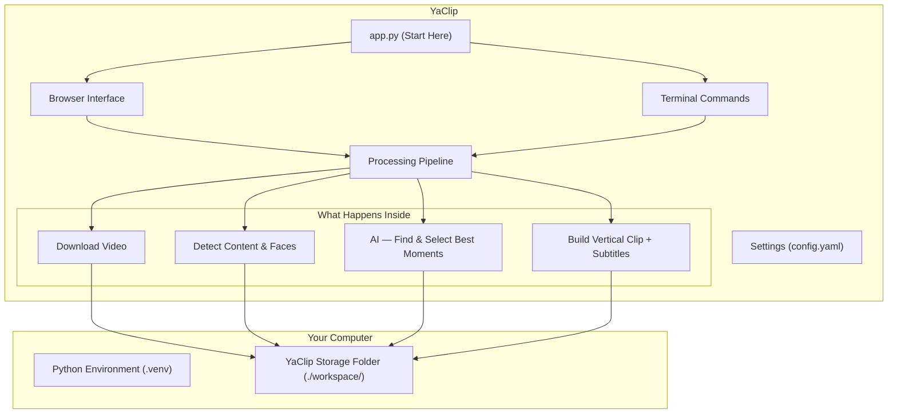

# ✂️ Yet Another AI Auto-Clipper (YaClip) for YouTube Shorts, Reels & TikTok

**YaClip** automatically turns long YouTube videos into short vertical clips, ready to post on YouTube Shorts, Instagram Reels, or TikTok. Just paste a YouTube link — YaClip downloads the video, finds the most engaging moments using AI, and exports polished 9:16 vertical clips with animated subtitles. No video editing skills required.

It works on **Windows, macOS, Linux, and WSL2**, and is designed to run well even on low-spec computers.

---

## ✨ What YaClip Does For You

*   **📦 Self-contained — no extra software to install manually:** Auto-downloads everything it needs (video tools, fonts, AI models) into its own folder on first run. Nothing installed system-wide.
*   **🧠 AI-powered clip selection:** Uses Google Gemini, OpenAI, or local AI to read the video transcript and pick the most engaging, shareable moments. Works fully offline too.
*   **⚡ Fast — even on long videos:** First identifies the loudest and most-replayed sections, then only analyses those — making AI processing up to 95% faster.
*   **💻 Two ways to use it:** A browser-based visual interface or a terminal command for automation.
*   **✂️ Manual control when you want it:** Enter your own timestamps and let YaClip handle framing, subtitles, and rendering.
*   **🎥 Smart camera framing:** Auto-detects faces and webcams, frames the vertical clip so the speaker stays centred — even in gaming streams with multiple webcams.
*   **🛟 Crash-proof rendering:** Uses GPU encoder (NVIDIA/Intel/Apple) when available; falls back to CPU if the GPU fails, so clips never fail to render.
*   **🏃 Fast mode for low-spec PCs:** Optional lightweight face-tracking for podcast clips on machines without a GPU.
*   **🔤 Animated word-by-word subtitles:** Each spoken word is highlighted as it's said. Permanently baked into the video.
*   **📝 Auto-generated metadata:** Every clip gets a `.txt` file with catchy title, caption, description, and hashtags — in the video's language, ready to copy-paste when posting.
*   **⚙️ One settings file:** All options in a single `config.yaml`.

---

## 🧬 Technology

YaClip brings together computer vision, audio processing, and AI in a single automated pipeline:

*   **Content Type Detection:** YOLOv8n + HUD analysis + webcam filtering across 25 sampled frames — automatically detects podcast, gaming solo, gaming collab, or live stream.
*   **Smart Framing:** MediaPipe face tracking with audio-visual speaker detection, two-shot grouping, and gentle camera glide between speakers.
*   **3 Layout Modes:** Single vertical (podcast), 2-stack facecam+gameplay (solo/chat), 3-stack facecam+gameplay+collab. Donation overlays get their own facecam+popup layout.
*   **Hybrid AI:** Independent STT + LLM providers — local + cloud, cloud + cloud, or fully offline. Pre-ranks candidates to cut AI cost by up to 95%.
*   **Word-by-Word Subtitles:** ASS karaoke effect with hallucination filter. Supports ~34 languages with optional language-locking primer.
*   **Crash-Proof Pipeline:** 3-pass memory-safe rendering (YOLO → Whisper → FFmpeg). GPU encoder auto-fallback. Portable workspace with auto-cleanup.

> See [Architecture Overview](docs/ARCHITECTURE.md) and [Pipeline Workflows](docs/WORKFLOWS.md) for full technical details.

---

## 🎬 How It Works

When you give YaClip a YouTube URL, it goes through these steps automatically:

1. **Download** — downloads the video and audio
2. **Detect** — analyses the video to understand what type of content it is
3. **Find moments** — uses YouTube's most-replayed data or audio energy peaks to locate candidate sections
4. **Transcribe** — converts audio of those sections to text
5. **AI picks the best clips** — selects the most engaging moments, gives each a title
6. **Review** — shows proposed clips before rendering; you can edit, delete, or approve
7. **Render** — builds the final vertical video with subtitles and smart framing
8. **Done** — clips saved and ready to upload



---

## 🎯 Supported Video Types

YaClip auto-detects the content type and adjusts framing and layout. You can override detection in `config.yaml` or from the WebUI review panel.

| Video Type | What it looks like | Vertical layout |
|---|---|---|
| **Podcast / Panel** | One or more speakers, no gameplay | Full-screen vertical; auto-frames the active speaker with smooth camera glide |
| **Just Chatting** | Single streamer, no gameplay | Webcam on top, stream content on bottom |
| **Gaming — Solo** | Gameplay on screen, one webcam | Webcam on top, static gameplay crop on bottom |
| **Gaming — Collab** | Gameplay on screen, 2+ webcams | Webcam 1 on top, gameplay in centre, Webcam 2 on bottom |
| **Donation Alert** | MediaShare/donation popup during clip | Webcam on top, donation popup on bottom |

> Donation alert clips use a dedicated layout when `preserve_donation_overlays: true` in `config.yaml` (disabled by default).

---

## 🧠 AI Options

*   **Cloud AI — Google Gemini / OpenAI (recommended):** Sends audio to cloud AI for transcription and clip selection. Requires API key. Fast and accurate.
*   **Local transcription + Cloud AI:** Free transcription on your computer, text sent to cloud for clip selection. Good balance of cost and quality.
*   **Fully offline:** Both transcription and clip selection run on your computer. No internet or API key needed.

> All three produce the same output — the choice only affects speed, cost, and internet requirements.

---

## 📦 Storage & Automatic Cleanup

All files live inside `workspace/` in the project directory. Nothing is written outside of it.

| Folder | What's stored there |
|---|---|
| `workspace/bin/` | Video tools (auto-downloaded on first run) |
| `workspace/fonts/` | Subtitle fonts (auto-downloaded) |
| `workspace/models/` | Local AI models (downloaded on first use) |
| `workspace/videos/` | Raw downloaded videos |
| `workspace/audios/` | Extracted audio files |
| `workspace/data/` | Transcripts, AI results, cached data |
| `workspace/clips/` | Your finished vertical clips |
| `workspace/tmp/` | Temporary files (auto-cleaned) |

**Automatic cleanup:** On every start, files older than 3 days (videos, audio, data) and 1 day (tmp) are deleted. Finished clips are never auto-deleted. Adjust retention in `config.yaml` or clear from the Maintenance tab.

---

## 🚀 Getting Started

### What You Need

| Requirement | Version | Where to get it |
|---|---|---|
| **Python** | 3.10 or newer | [python.org/downloads](https://www.python.org/downloads/) |
| **Git** | Any | [git-scm.com](https://git-scm.com/downloads) |

### CPU or GPU?

| | CPU Setup *(recommended)* | GPU Setup *(optional)* |
|---|---|---|
| **Works on** | All computers | NVIDIA GPU computers only |
| **AI speed** | Normal | Faster |
| **Disk space** | ~2–3 GB | ~6–7 GB |
| **Install complexity** | Simple | Extra steps after main install |

> **WSL2 users:** use the CPU setup — GPU support inside WSL2 requires extra configuration not covered here.

---

## 📥 Download & Run (Prebuilt)

Download a ready-to-run build from [GitHub Releases](https://github.com/dimaskiddo/yaclip/releases):

| | CPU build | CUDA build |
|---|---|---|
| **Works on** | Any machine — Windows, macOS (Apple Silicon), Linux | NVIDIA GPU machines only |
| **Platforms** | Linux AMD64/ARM64, macOS ARM64, Windows AMD64 | Linux AMD64, Windows AMD64 |
| **Size** | ~1–2 GB | ~4–6 GB (bundles CUDA runtime) |

**To run:** unzip → run `./yaclip` (macOS/Linux) or `yaclip.exe` (Windows). First launch downloads tools into a `workspace/` folder next to the executable. Bare invocation launches the WebUI; pass CLI arguments for terminal use.

> **macOS:** right-click → **Open** to bypass Gatekeeper on first launch.

---

## 🛠️ Installation

### Step 1 — Clone

```bash
git clone https://github.com/dimaskiddo/yaclip.git
cd yaclip
```

### Step 2 — System Libraries *(Linux/WSL2 only)*

> Windows/macOS: skip this step.

| Distro | Command |
|---|---|
| Ubuntu / Debian | `sudo apt-get install -y libegl1 libgles2 libgl1` |
| Fedora / RHEL | `sudo dnf install -y mesa-libEGL mesa-libGLES mesa-libGL` |
| Arch / Manjaro | `sudo pacman -S --noconfirm libglvnd mesa` |
| Alpine | `sudo apk add mesa-egl mesa-gles` |
| openSUSE | `sudo zypper install -y Mesa-libEGL1 Mesa-libGLESv2-2` |

### Step 3 — Create Python Environment

```bash
python3 -m venv .venv
source .venv/bin/activate          # Linux/macOS/WSL2
# .venv\Scripts\activate.bat       # Windows CMD
# .venv\Scripts\Activate.ps1       # Windows PowerShell
```

### Step 4 — Install Packages

```bash
# 1. Upgrade build tools
pip install --no-cache-dir --upgrade pip setuptools wheel

# 2. Install all packages
pip install --no-cache-dir -r requirements.txt

# 3. Restore correct video library (prevents crash on WSL2/Linux)
pip install --no-cache-dir --force-reinstall --no-deps opencv-python-headless
```

**GPU users** — after steps 1–3, additionally run:
```bash
pip install --no-cache-dir -r requirements-cuda.txt
pip install --no-cache-dir --force-reinstall --no-deps opencv-python-headless
export YACLIP_FORCE_TRITON=1       # add to ~/.bashrc or ~/.zshrc
```

### Step 5 — Configure

```bash
cp config.yaml.example config.yaml
```

Set your AI provider API key in `config.yaml` under `ai_pipeline`. Everything else works with defaults.

### Step 6 — Verify

```bash
python app.py config
```

You should see your settings printed with no errors.

### 🐳 Docker Alternative

Skip Steps 2–4 if you have Docker:

```bash
docker build -t dimaskiddo/yaclip .
cp config.yaml.example config.yaml

# Run clip command:
docker run --rm -v "$PWD/workspace:/app/workspace" -v "$PWD/config.yaml:/app/config.yaml" \
  dimaskiddo/yaclip clip "https://www.youtube.com/watch?v=<id>"

# Or open the browser interface:
docker run --rm -p 7860:7860 -v "$PWD/workspace:/app/workspace" -v "$PWD/config.yaml:/app/config.yaml" \
  dimaskiddo/yaclip serve
```

> For GPU: build with `docker build -f Dockerfile.CUDA -t dimaskiddo/yaclip-cuda .` and add `--gpus all` to `docker run`.

---

## 🕹️ How to Use YaClip

### 🌐 Browser Interface

```bash
python app.py              # launches WebUI at http://127.0.0.1:7860
```

| Tab | What it does |
|---|---|
| **Clipper** | Paste URL, choose clip count/duration/language, or switch to Manual mode for own timestamps |
| **Review & Render** | View proposed clips, edit/delete/approve before rendering |
| **Settings** | Change config from the browser |
| **Maintenance** | Disk usage overview, cache cleanup |

> **WSL2:** open `http://127.0.0.1:7860` in your **Windows** browser.

### 💻 Terminal Commands

**Generate clips:**
```bash
python app.py clip "https://www.youtube.com/watch?v=<id>"
```

| Option | Description | Default |
|---|---|---|
| `--clips N` | Number of clips | 5 |
| `--duration S` | Target clip length (seconds) | 60 |
| `--language L` | Subtitle language (e.g. `en`, `id`) | auto-detect |
| `--output-dir D` | Output directory | `workspace/clips/` |
| `--force` | Re-download even if cached | off |
| `--manual` | Use own timestamps (requires `--timerange-file`) | off |
| `--timerange-file F` | Path to timestamp file (requires `--manual`) | — |
| `--no-metadata` | Manual mode: skip AI titles/captions | off |

**Manual mode — pick your own timestamps:**

Create a text file, one clip per line (`START - END` in `MM:SS` or `HH:MM:SS`). Optionally add `| CONTENT_TYPE` to pin the layout:
```
1:30 - 2:30 | JUST_CHAT
10:44 - 11:55 | GAMING_COLLAB
12:30 - 14:20
```

Valid types: `PODCAST`, `JUST_CHAT`, `GAMING_SOLO`, `GAMING_SOLO_BOTTOM`, `GAMING_COLLAB`, `DONATION_OVERLAY`.

```bash
python app.py clip "<url>" --manual --timerange-file ranges.txt            # with AI titling
python app.py clip "<url>" --manual --timerange-file ranges.txt --no-metadata  # without AI
```

**Other commands:**
```bash
python app.py cache status          # disk usage per folder
python app.py cache purge --concern # delete old files (default: dry-run preview)
python app.py cache clean tmp       # force-delete all files in a directory
python app.py config                # print validated settings
```

---

## 📦 Building Redistributable Binaries

YaClip uses [PyInstaller](https://pyinstaller.org/) to build standalone folders — no venv needed on the end user's machine.

```bash
make release                          # CPU build for your OS/arch
make release VARIANT=cuda             # CUDA variant (Linux/Windows NVIDIA only)
make publish TAG=v0.1.0               # publish to GitHub Releases
```

The [Release workflow](.github/workflows/release.yml) builds all 6 platform variants (4 CPU + 2 CUDA) in parallel via GitHub Actions.

> `workspace/` and `config.yaml` resolve next to the executable in PyInstaller builds.

---

## 🧪 For Developers — Running Tests

```bash
source .venv/bin/activate
pytest tests/                                        # all tests
pytest tests/ --cov=src --cov-report=term-missing    # with coverage
pytest tests/ -m integration                         # integration only
```

---

## ✍️ Authors

*   **Dimas Restu Hidayanto** — [DimasKiddo on GitHub](https://github.com/dimaskiddo)

---

## 🏗️ Built With

*   [Python](https://www.python.org/) — programming language
*   [Gradio](https://gradio.app/) — browser interface
*   [yt-dlp](https://github.com/yt-dlp/yt-dlp) — YouTube video downloader
*   [FFmpeg](https://ffmpeg.org/) — video processing and rendering
*   [PyTorch](https://pytorch.org/) — AI model runtime
*   [faster-whisper](https://github.com/SYSTRAN/faster-whisper) — local speech-to-text
*   [MediaPipe](https://ai.google.dev/edge/mediapipe/solutions/guide) — face detection
*   [Ultralytics YOLOv8](https://docs.ultralytics.com/) — object and region detection
*   [OpenCV](https://opencv.org/) — video frame analysis
*   [Loguru](https://github.com/Delgan/loguru) — application logging

---

## ⚠️ Disclaimer

Use at your own risk. YaClip is provided as-is with no guarantees. The authors are not responsible for any issues arising from its use, including API costs, platform terms of service actions, or data loss. Always review the terms of service of any platform you download content from or upload clips to.

---

## ⚖️ License

Distributed under the **MIT License**. See `LICENSE` for more information.

---
**YaClip** — *From long video to ready-to-post short clip, automatically.* ✂️
