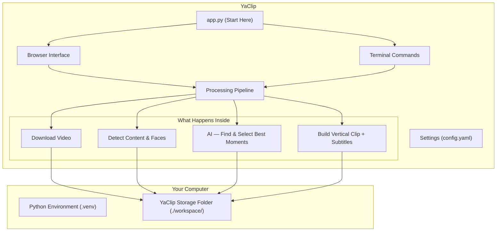

# ✂️ Yet Another AI Auto-Clipper (YaClip) for YouTube Shorts, Reels & TikTok

**YaClip** automatically turns long YouTube videos into short vertical clips, ready to post on YouTube Shorts, Instagram Reels, or TikTok. Just paste a YouTube link — YaClip downloads the video, finds the most engaging moments using AI, and exports polished 9:16 vertical clips with animated subtitles. No video editing skills required.

It works on **Windows, macOS, Linux, and WSL2**, and is designed to run well even on low-spec computers.

---

## ✨ What YaClip Does For You

*   **📦 Self-contained — no extra software to install manually:** YaClip automatically downloads everything it needs (video tools, fonts, AI models) into its own folder on first run. Nothing is installed system-wide.
*   **🧠 AI-powered clip selection:** Uses Google Gemini or other AI services to read through the video transcript and pick the most interesting, shareable moments. Works offline too with a local AI model.
*   **⚡ Fast — even on long videos:** Instead of reading the entire transcript of a 2-hour video, YaClip first identifies the loudest and most-replayed sections, then only analyses those. This makes AI processing up to 95% faster.
*   **💻 Two ways to use it:** A browser-based visual interface (just open a link in your browser) or a terminal command for automation.
*   **✂️ Manual control when you want it:** Not happy with auto-detection? You can enter your own timestamps instead and let YaClip handle the rest.
*   **🎥 Smart camera framing:** Automatically detects faces and webcams, and frames the vertical clip so the person stays centred and visible — even in gaming streams with multiple webcams.
*   **🛟 Crash-proof rendering:** Automatically uses your GPU encoder (NVIDIA/Intel/Apple) when available for faster renders, and if the GPU encoder ever fails it falls back to CPU so a clip never fails to render. Set `video_encoder: cpu` to force software encoding.
*   **🏃 Fast mode for low-spec PCs:** An optional lightweight face-tracking mode (`fast_mode`) renders podcast clips much faster on computers without a GPU, trading multi-speaker tracking for speed.
*   **🔤 Animated word-by-word subtitles:** Each spoken word is highlighted as it's said. Subtitles are permanently baked into the video so they show on every platform without any extra steps.
*   **📝 Auto-generated clip descriptions & hashtags:** For every clip, YaClip creates a `.txt` file with a catchy title, short caption, full description, and hashtags — written in the video's language with a hook/bait human tone. Ready to copy-paste when posting to YouTube Shorts, Instagram Reels, or TikTok.
*   **⚙️ One settings file:** All options — AI provider, subtitle style, clip length, language — are in a single `config.yaml` file that you edit once.

---

## 🧬 Technology & Algorithms

YaClip brings together computer vision, audio processing, and AI in a single automated pipeline. Here's what powers it:

### 🎯 Content Type Detection Engine
Before any clip is selected, YaClip analyzes the whole video to determine what type of content it is — podcast, gaming solo, gaming collaboration, or live stream. It uses **YOLOv8n** (Ultralytics COCO) to detect people, webcams, and screen regions across 25 sampled frames, plus **HUD analysis** (temporal variance + spatial gradient) to detect gameplay UI elements like health bars and minimaps. A dedicated **webcam filter** separates real streamer webcams from in-game characters by persistence, area fraction, edge proximity, and spatial separation — eliminating the #1 cause of false collaboration detection. When signals are too weak, structured detection evidence is passed to an LLM for the final decision.

### 🎥 Intelligent Scene Analysis
YaClip's visual engine performs dense per-candidate window analysis using YOLOv8n to extract facecam regions, gameplay boxes, and donation popups. A dedicated **MediaShare donation detection** module scans at ~2 fps with appearance/disappearance logic and a **box-centre jitter gate** that rejects drifting gameplay motion while catching static donation cards. Two spatial guards (aspect gate, cam-exclusion zone) prevent false positives from webcam borders or game HUD elements.

### 👤 Active Speaker Tracking (Podcast Mode)
For podcast and panel content with multiple speakers, YaClip uses **MediaPipe FaceLandmarker** to track up to 8 faces simultaneously. The **Mouth-Aspect-Ratio (MAR)** signal — computed from inner-lip vertical landmarks divided by mouth width — measures speech activity independently of face size. A **per-clip RMS audio envelope** gates speaker switching to voiced moments only, and **Pearson correlation** between mouth movement windows and audio windows (`AV_SYNC_WINDOW_SECONDS`) determines which face is actually speaking moment-to-moment. An **occlusion-aware hold** prevents jumping to a smiling non-speaker when the talker's lips are hidden behind a mic. **Two-shot grouping** frames both speakers together when they sit close enough (median span and gap tests), avoiding rapid cuts. **Exponential Moving Average (EMA) pan** at τ≈1.1s (30 fps) glides the crop from one speaker to the next — no snap cuts.

### 🎮 Smart Gaming Layouts
Three layout modes adapt to the content: **Mode A (single vertical)** for podcasts, **Mode B (2-stack — facecam top, gameplay bottom)** for solo gaming and live streams, and **Mode C (3-stack — primary facecam, gameplay center, collaborator bottom)** for gaming collaborations. The gameplay region uses a **static motion-centroid crop** (`_motion_region`) computed from visual analysis — centred on the action, zoomed by configurable `gameplay_zoom`, and locked for the whole clip so the viewer's eye stays steady. Collaboration clips exclude both webcams from the gameplay crop to prevent any "double facecam" bleeding.

### ⚡ Candidate Pre-Ranking & Hybrid Selection
YaClip ranks candidate moments before any AI cost. **YouTube Most Replayed heatmap data** (saved during download) or an **FFmpeg RMS energy pipeline** (8 kHz mono PCM) produces a scored spike list. Only the top `target_clips + margin` candidates are transcribed and sent to the AI — cutting STT and LLM cost by up to 95% on a 2-hour video with 25 candidate windows. The margin is **additive** (not a multiplier), so cost stays bounded even at high clip counts.

### 🧠 Hybrid AI Pipeline
STT (speech-to-text) and LLM (clip selection) are configured independently — each can be **cloud** (Google Gemini, OpenAI) or **local** (faster-whisper, llama-cpp-python). The most powerful combination is **local STT + cloud LLM**: free high-quality transcription from faster-whisper paired with Gemini's or GPT's clip-ranking ability. When both use Google Gemini, audio is uploaded once and processed in a single unified call. The system detects the content type algorithmically first and only defers to the LLM when uncertain — and when it does, it injects **structured detection evidence** (webcam count, gameplay flag, HUD score, open area fraction) into the prompt so the LLM never hallucinates wrong layouts.

### 📝 Word-by-Word Subtitle Rendering
Subtitles use the **Advanced SubStation Alpha (ASS)** format with one Dialogue event per word. The active word is rendered **bold + 12% larger + highlight-coloured** while the rest of the line stays normal — a karaoke-style focus effect. Whisper output passes through a **hallucination filter** that drops segments with high compression ratios, high no-speech probability, or single-token repetition loops. An optional **language-locking primer** sends a native-language transcription instruction (supporting ~34 ISO 639-1 languages) to sharpen accuracy on specified languages.

### 🔒 Crash-Proof Rendering Pipeline
Rendering follows a strict 3-pass memory-safe order: **regions (YOLO) → words (Whisper) → encode (FFmpeg)**, with each model freed and garbage-collected before the next loads. If a GPU encoder (NVENC/QSV/VideoToolbox) fails at runtime, the system detects the hardware failure signature in FFmpeg's stderr and automatically retries with **libx264 CPU encoding** — a clip never fails to render due to GPU issues. Word-level timestamps from the selection phase are cached and reused in the rendering phase, eliminating a redundant Whisper pass on full cache hits.

### 📦 Portable Cache & Boot Integrity
Every runtime dependency — FFmpeg, Bun JS runtime, subtitle fonts, AI models — is auto-downloaded into the `./workspace/` directory on first boot. The **HuggingFace Hub cache** is redirected to `./workspace/models/` so all model downloads stay local. A **sequential purge engine** with per-directory retention settings (videos: 3 days, tmp: 1 day, clips: never) prevents unbounded disk growth. Everything runs through a strict virtual environment with zero system-level writes.

### 📝 Auto-Generated Clip Metadata
For every rendered clip, YaClip writes a `clips_{video_id}_{i}_{title}.txt` file containing a **Title, Caption, Description, and Hashtags** ready for social media uploads. These are generated by the LLM during the selection phase in the video's detected language — so an Indonesian gaming clip gets Indonesian hashtags and hook text, while an English podcast gets English copy. The tone is deliberately **relaxed, informal, and hook/bait** — like a real person posting on social media, not a corporate AI. The LLM is instructed to base all metadata on the actual clip transcript content and never invent details.

---

## 🎬 How It Works

When you give YaClip a YouTube URL, it goes through these steps automatically:

1. **Download** — downloads the video and audio
2. **Detect** — analyses the video to understand what type of content it is (podcast, panel discussion, gaming stream, just chat, etc.)
3. **Find moments** — uses YouTube's own most-replayed data or audio energy peaks to locate the best candidate sections
4. **Transcribe** — converts the audio of those sections to text
5. **AI picks the best clips** — sends the transcripts to an AI model which selects the most engaging moments and gives each one a title
6. **Review** — shows you the proposed clips before rendering anything; you can edit, delete, or approve. CLI renders directly without a review gate.
7. **Render** — builds the final vertical video with subtitles and smart framing
8. **Done** — clips saved and ready to upload



---

## 📚 Detailed Technical Documentation

For a full breakdown of the internal architecture, processing pipeline, and configuration options, see:
- [Architecture Overview](docs/ARCHITECTURE.md)
- [Pipeline Workflows](docs/WORKFLOWS.md)

---

## 🎯 Supported Video Types

YaClip automatically detects what kind of video you're working with and adjusts how it frames and layouts the vertical clip. You don't need to set this manually — but you can override it if the detection is wrong.

| Video Type | What it looks like | Vertical layout |
|---|---|---|
| **Podcast / Panel** | One speaker OR multiple people taking turns talking (no gameplay) | Full-screen vertical; when 2+ faces: **frames both together** if they sit close enough (no cuts); otherwise follows whoever is actually speaking — matched against the audio moment-to-moment, so a smiling/reacting person (or someone whose mouth is hidden behind a mic) isn't framed by mistake. Static while a speaker holds, gentle glide on a change (min 2 s hold), faces framed with proper headroom. |
| **Just Chatting** | Single streamer, no gameplay, may have donation alerts | Webcam on top, stream content on bottom |
| **Gaming — Solo** | Gameplay confirmed on screen, one webcam in corner | Webcam on top, **static gameplay crop** on bottom (centred on the action, no pan) |
| **Gaming — Collab** | Gameplay confirmed, two or more webcams | Webcam 1 on top, **static gameplay crop** in centre, Webcam 2 on bottom |
| **Donation Alert** | A donation or media share popup appears during the clip | Webcam on top, donation popup on bottom |

> Donation alert clips can be handled automatically — when enabled in `config.yaml` (`preserve_donation_overlays: true`), any clip where a Trakteer or MediaShare popup appears will use the Donation Alert layout instead of the base type layout. This is **disabled by default** so clips stay with their first-detected content type. You can enable donation handling and configure exclusions in `config.yaml` under `video_processing.preserve_donation_overlays` and `video_processing.donation_overlay_exclude_types`.

---

## 🧠 AI Options

YaClip supports several combinations of AI services for transcription and clip selection. You control this in `config.yaml`.

*   **Cloud AI — Google Gemini / OpenAI (recommended for best quality):** Sends audio to a cloud AI service which transcribes it and picks the best clips in one step. Requires an API key. Fast and accurate.
*   **Local transcription + Cloud AI selection:** Transcribes on your own computer for free, then sends just the text to a cloud AI for clip selection. Good balance of cost and quality.
*   **Fully offline:** Both transcription and clip selection run entirely on your computer with no internet connection or API key needed. Slower, but fully private and free.

> All three options produce the same output — the choice only affects speed, cost, and whether you need an internet connection.

---

## 📦 Storage & Automatic Cleanup

YaClip keeps all its files inside a `workspace/` folder in the project directory. Nothing is written outside of it.

| Folder | What's stored there |
|---|---|
| `workspace/bin/` | Video download and processing tools (auto-downloaded on first run) |
| `workspace/fonts/` | Subtitle fonts (auto-downloaded on first run) |
| `workspace/models/` | Local AI model files (downloaded when first used) |
| `workspace/videos/` | Raw downloaded videos |
| `workspace/audios/` | Extracted audio files |
| `workspace/subtitles/` | `.ass` subtitle files for rendered clips |
| `workspace/data/` | Transcripts, AI clip results, and cached data (word timings, heatmap, metadata) |
| `workspace/clips/` | Your finished vertical clips |
| `workspace/tmp/` | Temporary working files (deleted automatically) |

**Automatic cleanup:** Every time YaClip starts, it automatically deletes old files to free up disk space. By default: videos, audio, subtitles, and data files older than 3 days are removed; temporary files older than 1 day are removed. Your finished clips in `workspace/clips/` are never auto-deleted. You can adjust retention settings in `config.yaml` or clear the cache manually from the Maintenance tab.

---

## 🚀 Getting Started

### 📋 What You Need Before Installing

Before you begin, make sure you have the following installed on your computer:

| Requirement | Version | Where to get it |
|---|---|---|
| **Python** | 3.10 or newer | [python.org/downloads](https://www.python.org/downloads/) |
| **uv** *(recommended)* or pip | Any | [docs.astral.sh/uv](https://docs.astral.sh/uv/getting-started/installation/) |
| **Git** | Any | [git-scm.com](https://git-scm.com/downloads) |

> **How to check if Python is already installed:**
> Open a terminal and type `python3 --version` (Linux/macOS) or `python --version` (Windows).
> You need version **3.10 or higher**.

---

### 🖥️ CPU or GPU — Which Setup is Right for You?

YaClip works on **any computer**. Before installing, pick the setup that matches your hardware:

| | CPU Setup *(default, recommended)* | GPU Setup *(optional, faster)* |
|---|---|---|
| **Works on** | All computers — Windows, macOS, Linux, WSL2, low-spec laptops | Computers with a **dedicated NVIDIA GPU** only |
| **AI processing speed** | Normal | Faster (local AI models run on the GPU) |
| **Disk space used** | ~2–3 GB | ~6–7 GB |
| **Install complexity** | Simple — just follow the steps below | Extra steps after the main install |
| **Recommended for** | Most users, WSL2, Docker, any computer without an NVIDIA GPU | Users who want faster local AI processing |

> **Not sure if you have an NVIDIA GPU?**
> - **Windows:** Open Task Manager → Performance tab → look for any "GPU" entry labelled NVIDIA.
> - **Linux:** Run `nvidia-smi` in a terminal. If you see GPU information, you have one. If the command is not found, you don't.
> - **WSL2:** Even if your Windows PC has an NVIDIA GPU, use the **CPU setup** for WSL2 — getting a GPU to work inside WSL2 requires extra configuration that is not covered here.

---

## 🛠️ Installation

### Step 1 — Download YaClip

Open a terminal and run:

```bash
git clone https://github.com/dimaskiddo/yaclip.git
cd yaclip
```

---

### Step 2 — Install System Libraries *(Linux and WSL2 only)*

> **Windows and macOS users: skip this step entirely.**

The face-detection feature requires a small set of graphics libraries that most Linux and WSL2 systems do not include by default. Install them once with the command for your distribution:

| My Linux distro is... | Run this command |
|---|---|
| Ubuntu / Debian / Linux Mint | `sudo apt-get install -y libegl1 libgles2 libgl1` |
| Fedora / RHEL / CentOS | `sudo dnf install -y mesa-libEGL mesa-libGLES mesa-libGL` |
| Arch Linux / Manjaro | `sudo pacman -S --noconfirm libglvnd mesa` |
| Alpine Linux | `sudo apk add mesa-egl mesa-gles` |
| openSUSE | `sudo zypper install -y Mesa-libEGL1 Mesa-libGLESv2-2` |

> Don't know your distro? Run `cat /etc/os-release` and look at the `NAME=` line.
> If these libraries are missing, YaClip will detect it at startup and print the exact command to install them.

---

### Step 3 — Create an Isolated Python Environment

This keeps YaClip's packages separate from everything else on your computer and prevents conflicts.

```bash
python3 -m venv .venv
```

Then **activate** the environment. You need to do this every time you open a new terminal to use YaClip:

```bash
# Linux / macOS / WSL2:
source .venv/bin/activate

# Windows (Command Prompt):
.venv\Scripts\activate.bat

# Windows (PowerShell):
.venv\Scripts\Activate.ps1
```

> When the environment is active, you'll see `(.venv)` at the start of your terminal prompt.

---

### Step 4 — Install YaClip Packages

#### 🟢 CPU Setup *(recommended for most users)*

Run these two commands **in order**. Both are required.

**4a. Install all packages:**

```bash
# Using uv (recommended — much faster):
uv sync --locked

# Using pip (alternative):
pip install --no-cache-dir -r requirements.txt
```

**4b. Restore the correct video library *(required — do not skip)*:**

Some packages installed in step 4a will silently swap out a critical video library with a version that crashes on WSL2 and Linux servers. This command puts the correct one back:

```bash
# Using uv:
uv pip install --no-cache --force-reinstall --no-deps opencv-python-headless

# Using pip:
pip install --no-cache-dir --force-reinstall --no-deps opencv-python-headless
```

---

#### 🟡 GPU Setup *(only if you have an NVIDIA GPU)*

First, complete steps 4a and 4b above exactly as written. Then run these **additional** commands to replace the CPU AI library with the GPU version:

```bash
# Remove the CPU version that was just installed:
uv pip uninstall torch torchvision

# Install the GPU version:
# (Replace "cu121" with your CUDA version if different — check with: nvidia-smi)
uv pip install --no-cache torch==2.12.0+cu121 torchvision==0.27.0+cu121 \
  --index-url https://download.pytorch.org/whl/cu121
```

Then tell YaClip that a real GPU is present by setting an environment variable:

```bash
# Linux / macOS / WSL2 — add this line to your ~/.bashrc or ~/.zshrc:
export YACLIP_FORCE_TRITON=1

# Windows — run this once in PowerShell:
[Environment]::SetEnvironmentVariable("YACLIP_FORCE_TRITON", "1", "User")
```

---

#### 🔴 Switching back to CPU (if something went wrong)

If you previously installed AI packages outside of this guide, you may have a GPU version of the AI library installed without realising it — this can cause YaClip to crash silently on startup. Switch back to the safe CPU version with:

```bash
# Remove the GPU version and everything it brought with it:
uv pip uninstall torch torchvision triton \
  nvidia-cublas-cu13 nvidia-cudnn-cu13 nvidia-cuda-runtime-cu13 nvidia-cuda-nvrtc-cu13 \
  nvidia-cuda-cupti-cu13 nvidia-cufft-cu13 nvidia-curand-cu13 nvidia-cusolver-cu13 \
  nvidia-cusparse-cu13 nvidia-nccl-cu13 nvidia-nvjitlink-cu13 nvidia-nvtx-cu13 \
  cuda-toolkit cuda-bindings 2>/dev/null || true

# Install the CPU version:
uv pip install --no-cache torch==2.12.0+cpu torchvision==0.27.0+cpu \
  --index-url https://download.pytorch.org/whl/cpu

# Restore the correct video library (same as step 4b):
uv pip install --no-cache --force-reinstall --no-deps opencv-python-headless
```

---

### Step 5 — Create Your Configuration File

Copy the example configuration and open it in any text editor:

```bash
cp config.yaml.example config.yaml
```

The most important thing to set is your AI provider API key under `ai_pipeline` — without it, YaClip will fall back to local AI only. Everything else works with the default values.

---

### Step 6 — Verify Your Installation

Run this to confirm everything installed correctly:

```bash
python app.py config
```

You should see your settings printed with no errors. If you get an error, make sure your environment is still active (you should see `(.venv)` in your prompt from Step 3) and that both commands in Step 4 completed without errors.

---

### 🐳 Alternative: Docker *(no manual setup required)*

If you have Docker installed, you can skip Steps 2–4 entirely. Docker packages everything YaClip needs into a single container.

```bash
# 1. Build the container (one time only):
docker build -t dimaskiddo/yaclip .

# 2. Copy the configuration file:
cp config.yaml.example config.yaml

# 3. Run a clip command:
docker run --rm \
  -v "$PWD/workspace:/app/workspace" \
  -v "$PWD/config.yaml:/app/config.yaml" \
  dimaskiddo/yaclip clip "https://www.youtube.com/watch?v=<id>"

# 4. Or open the browser interface :
docker run --rm -p 7860:7860 \
  -v "$PWD/workspace:/app/workspace" \
  -v "$PWD/config.yaml:/app/config.yaml" \
  dimaskiddo/yaclip serve
```

Then open `http://localhost:7860` in your browser. *(Launches the YaClip WebUI with tabs: Clipper, Review & Render, Settings, Maintenance, and About.)*

> Your downloaded videos, AI models, and finished clips are saved to the `workspace/` folder on your computer — not inside the container — so they are kept between runs.

---

## 🕹️ How to Use YaClip

### 🌐 Browser Interface

> **Note:** Running `python app.py` without arguments launches the WebUI. Use the CLI commands below for direct terminal usage.

The WebUI starts with:

```bash
python app.py
```

Then open **`http://127.0.0.1:7860`** in your browser.

> **WSL2 users:** open this URL in your **Windows** browser, not inside WSL.

#### Tabs:
*   **Clipper** — Paste a YouTube URL, choose how many clips you want, how long they should be, and what language the subtitles should be in. Switch to Manual mode if you want to enter your own timestamps instead of letting AI choose.
*   **Review & Render** — Before anything is exported, YaClip shows you the proposed clips with their titles and timestamps. You can edit or delete any of them before clicking Render.
*   **Settings** — Change any setting from the browser without editing the config file directly.
*   **Maintenance** — See how much disk space each folder is using, and clear old files to free up space.
*   **About** — Project info and a link to support the developer.

---

### 💻 Terminal Commands

If you prefer working in a terminal:

**Generate clips from a YouTube video:**
```bash
python app.py clip "https://www.youtube.com/watch?v=<id>"
```

Optional options you can add:

| Option | What it does | Default |
|---|---|---|
| `--clips 3` | How many clips to generate | 5 |
| `--duration 45` | Target length of each clip in seconds | 60 |
| `--min-duration 30` | Lower bound of the clip-duration range | 30 |
| `--max-duration 180` | Upper bound of the clip-duration range | 180 |
| `--language id` | Subtitle language (e.g. `en`, `id`, `ja`) | auto-detect |
| `--output-dir ./my-clips` | Where to save the finished clips | `workspace/clips/` |
| `--force` | Re-download the video even if already downloaded | off |
| `--debug` | Verbose debug logging | off |
| `--manual` | Use your own timestamps instead of AI selection (requires `--timerange-file`) | off |
| `--timerange-file ranges.txt` | Path to your timestamp file (requires `--manual`) | — |
| `--no-metadata` | Manual mode only: skip AI titles/captions, just render at your timestamps | off |
| `--cookies-file cookies.txt` | Path to a cookies.txt file for YouTube authentication | — |

**✂️ Manual mode — pick your own clip timestamps:**

Create a text file, one clip per line, `START - END` in `MM:SS` or `HH:MM:SS`. Optionally add `| CONTENT_TYPE` to pin the layout for that clip; leave it off to auto-detect that range:
```
1:30 - 2:30 | JUST_CHAT
10:44 - 11:55 | GAMING_COLLAB
12:30 - 14:20
```
Valid types: `PODCAST`, `JUST_CHAT`, `GAMING_SOLO`, `GAMING_SOLO_BOTTOM`, `GAMING_COLLAB`, `DONATION_OVERLAY` (case-insensitive). The third line above has no type, so its layout is auto-detected. `GAMING_SOLO_BOTTOM` is a mirrored `GAMING_SOLO` (facecam bottom, gameplay top) — pin it explicitly here or via `content_type_override`, since auto-detection always defaults to regular `GAMING_SOLO`.

Then run:
```bash
# AI still writes a title/caption/description for each clip:
python app.py clip "https://www.youtube.com/watch?v=<id>" --manual --timerange-file ranges.txt

# Skip AI entirely — fastest, plain "Manual_1-30_2-30" filenames, no caption/description:
python app.py clip "https://www.youtube.com/watch?v=<id>" --manual --timerange-file ranges.txt --no-metadata
```
Manual mode ignores the clip-count and duration settings above — you always get exactly the clips you listed, at exactly those timestamps.

**Other commands:**

```bash
# Check how much disk space the cache folders are using:
python app.py cache status

# Delete old cached files to free up space (default: dry-run preview):
python app.py cache purge --concern

# Force-delete ALL files in a directory regardless of age:
python app.py cache clean tmp

# Print your current settings:
python app.py config
```

---

## 🧪 For Developers — Running Tests

```bash
# Activate environment first
source .venv/bin/activate

# Dev dependencies are already included via uv sync --locked
# (ruff, pytest, etc. are under [project.optional-dependencies] dev in pyproject.toml)

# Run all tests
pytest tests/

# Run with coverage
pytest tests/ --cov=src --cov-report=term-missing

# Run integration tests only
pytest tests/ -m integration
```

---

## ✍️ Authors

*   **Dimas Restu Hidayanto** — [DimasKiddo on GitHub](https://github.com/dimaskiddo)

---

## 🏗️ Built With

*   **[Python](https://www.python.org/)** — programming language
*   **[Gradio](https://gradio.app/)** — browser interface
*   **[yt-dlp](https://github.com/yt-dlp/yt-dlp)** — YouTube video downloader
*   **[FFmpeg](https://ffmpeg.org/)** — video processing and rendering
*   **[PyTorch](https://pytorch.org/)** — AI model runtime
*   **[faster-whisper](https://github.com/SYSTRAN/faster-whisper)** — local speech-to-text transcription
*   **[MediaPipe](https://ai.google.dev/edge/mediapipe/solutions/guide)** — face detection
*   **[Ultralytics YOLOv8](https://docs.ultralytics.com/)** — object and region detection
*   **[OpenCV](https://opencv.org/)** — video frame analysis
*   **[Loguru](https://github.com/Delgan/loguru)** — application logging

---

## ⚠️ Disclaimer

Use at your own risk. YaClip is provided as-is with no guarantees. The authors are not responsible for any issues arising from its use, including API costs, platform terms of service actions, or data loss. Always review the terms of service of any platform you download content from or upload clips to.

---

## ⚖️ License

Distributed under the **MIT License**. See `LICENSE` for more information.

---
**YaClip** — *From long video to ready-to-post short clip, automatically.* ✂️
