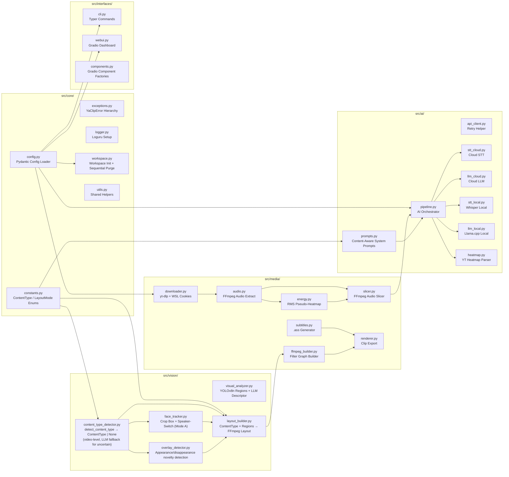

# Yet Another AI Auto-Clipper (YaClip) — Architecture

## System Overview

YaClip is a modular Python 3 application that downloads long-form YouTube videos, automatically detects the most engaging moments, and renders them as 9:16 vertical clips for **YouTube Shorts, Instagram Reels, and TikTok**. It runs entirely within a virtual environment with a self-contained portable asset cache, optimized for cross-platform portability (Windows, macOS, Linux, WSL) and low-to-medium spec hardware.

The application understands four video-level **content types** — `PODCAST`, `JUST_CHAT`, `GAMING_SOLO`, `GAMING_COLLAB` — plus a fifth **per-clip** type, `DONATION_OVERLAY`, to which any clip containing a mediashare/donation popup is promoted at render time, and a sixth **pin/override-only** type, `GAMING_SOLO_BOTTOM`, a mirrored `GAMING_SOLO` (facecam bottom, gameplay top) reachable only via manual timerange pin or `content_type_override` — never auto-detected or LLM-assigned. Each applies a unique layout and face-tracking strategy. Content type is detected automatically from video frames and audio cues; the user can override detection in `config.yaml` or from the WebUI review panel.

---

## Module Map

---

## Core Pillars

### 1. Portable Asset Cache (`./workspace/`)

All runtime assets live inside `./workspace/` within the project root. The OS temp directory (`/tmp/`, `%TEMP%`) is never used.

| Directory | Contents |
|---|---|
| `bin/` | FFmpeg + FFprobe static binaries, Bun JS runtime |
| `fonts/` | `.ttf` subtitle fonts (Anton as default; user may drop custom fonts here) |
| `models/` | Local GGUF LLM files, Whisper models (CTranslate2 auto-cached to `models/hf/`) |
| `models/hf/` | HuggingFace Hub cache (`HF_HOME` env var set here; all HF downloads land here automatically) |
| `videos/` | Raw yt-dlp downloads (`{VIDEO_ID_UCASE}.mp4`) |
| `audios/` | Extracted audio tracks (`{VIDEO_ID_UCASE}.aac`) |
| `subtitles/` | `.ass` subtitle files for rendered clips — 3-day retention |
| `data/` | STT transcripts (`.txt`), AI clip results (`.json`), per-candidate word cache (`{video_id}_words.json`), mediashare scan cache, heatmap data, video metadata — 3-day retention |
| `tmp/` | Scratch space: audio slices (`audio_{video_id}_{i}.aac`), slice STT transcripts for debugging (`.txt`), WSL cookie copies — 1-day retention |

**Workspace Integrity** (`src/core/workspace.py`): On every boot, checks each directory and auto-downloads any missing binary (FFmpeg via `static-ffmpeg`), Bun JS runtime, or subtitle font. Injects `./workspace/bin` into `PATH` and sets `HF_HOME=./workspace/models/hf/` so all HuggingFace Hub model downloads are routed to the workspace automatically — no `cache_dir` parameter is needed.

**HuggingFace Model Downloads** (`src/core/utils.py → AIUtils.resolve_llm_model_path`): GGUF models are resolved via `hf_hub_download(repo_id, filename)`. The `HF_HOME` env var ensures all downloads land in `./workspace/models/hf/`. No system-level cache directories are used.

**Sequential Purge**: A cleanup check runs sequentially at startup for CLI commands like `test-pipeline` and `serve`. Purgeable directories: `videos/` (3d), `audios/` (3d), `subtitles/` (3d), `data/` (3d), `tmp/` (1d), `clips/` (-1, never auto-purge). Protected: `bin/`, `fonts/`, `models/`.

---

### 2. Content Type Detection Engine (`src/vision/content_type_detector.py`)

Content type is detected **once per video**, before clip selection or rendering. The detector aggregates evidence across the **entire video** — 25 sampled frames, a gameplay presence probe, a reliable webcam count, a HUD score, and donation overlay sampling — making it far more reliable than per-clip classification, which suffers from noisy signals in short 60s windows.

**Detection pipeline (video-level, with LLM fallback for uncertain):**

| Step | Signal | Result |
|---|---|---|
| 1. Config override | `content_type_override ≠ "auto"` | Configured value (skips all detection) |
| 2. Gameplay gate | `open_area_frac ≥ 0.45` (or `≥ 0.30` with `gaming_hint`) **AND** (`non_person_motion ≥ 4.0` **OR** `gaming_hint` **OR** `has_hud`) | Confirmed gameplay |
| 3. Webcam count | `detect_facecams` (filtered by persistence/area/edge/separation — rejects game characters) | `< 2` → `GAMING_SOLO`; `≥ 2` → **`GAMING_COLLAB`** (confident — only genuine webcams survive filtering) |
| 4. No gameplay | `≥ 2` persistent faces → `PODCAST`; 1 face + donation → `JUST_CHAT`; 1 face → `PODCAST` | Concrete type |
| 5. Default | No signals matched | **`None`** (uncertain — defer to LLM with structured detection evidence block) |
| 6. LLM fallback (uncertain only) | When detector returns `None`, the batch LLM receives a **structured evidence block** (`gameplay_present`, `webcam_count`, `hud_score`, `gaming_hint`, `open_area_frac`, `non_person_motion`, `donation_detected`) plus audio speaker count, visual descriptors, and game metadata. LLM output is **post-validated**: ~1 speaker can't be COLLAB; ≥2 speakers + gameplay + ≥2 webcams forces COLLAB. | `PODCAST` / `JUST_CHAT` / `GAMING_SOLO` / `GAMING_COLLAB` |

Key improvements over the original per-clip approach:
- **`detect_facecams` replaces raw `face_count`** for the SOLO↔COLLAB split, eliminating cutscene-NPC false positives.
- **`gaming_hint` relaxes the open-area threshold** (0.30 vs 0.45) for close-up cam shots in gaming streams.
- **HUD score** adds a third corroboration signal alongside `gaming_hint` for the motion bypass.
- **Gameplay + ≥2 webcams = GAMING_COLLAB** (confident, not None — `detect_facecams` already excludes NPCs).
- **LLM fallback still used** for truly ambiguous cases, but with full detection evidence injected into the prompt and post-validation rules preventing hallucination.

The detected `ContentType` is threaded from `ContentTypeDetector.detect_content_type_full()` → `cli.py` → `AIPipeline.process_audio(detected_type=..., detection_evidence=...)` → `ClipRenderer.render_clips(content_type=...)`. When the detector returns a confident type, evidence is not sent to the LLM.

**Downstream routing table:**

| ContentType | Layout Mode | Face Switching | Donation Handling |
|---|---|---|---|
| `PODCAST` | Mode A — Single Vertical | Yes — active speaker when 2+ faces | **excluded by default** (pre-recorded; configurable) |
| `JUST_CHAT` | Mode B — Stacked Split-Screen | No | **disabled by default** (opt-in via `preserve_donation_overlays`) |
| `GAMING_SOLO` | Mode B — Stacked Split-Screen | No | **disabled by default** (opt-in via `preserve_donation_overlays`) |
| `GAMING_SOLO_BOTTOM` | Mode B — Stacked Split-Screen, panels mirrored (gameplay top / facecam bottom) | No | Same as `GAMING_SOLO` — **disabled by default** |
| `GAMING_COLLAB` | Mode C — Multi-Face Collab Stack | No | **excluded by default** (popup must not displace a panel; configurable) |
| `DONATION_OVERLAY` | Mode B geometry — facecam top + popup bottom | No | **this is the donation layout** |

**Per-clip donation promotion** (`renderer.ClipRenderer._apply_donation_override`): after per-clip region analysis (Pass 1), any clip with `mediashare_present` is promoted from its base type to `DONATION_OVERLAY` and routed to a facecam + popup 2-stack. **Disabled by default** (`preserve_donation_overlays: false`). When enabled, gated by `preserve_donation_overlays`; an explicit per-clip `content_type` (review edit) is never overridden. Types listed in `video_processing.donation_overlay_exclude_types` (default: `["PODCAST", "GAMING_COLLAB"]`) are never promoted — `PODCAST` because it is pre-recorded content with no live donation widgets, `GAMING_COLLAB` because the popup must not replace one of the three collab panels. This list is user-configurable. `DONATION_OVERLAY` is the single, consistent home for donation compositing — Modes A/B/C no longer embed donations.

---

### 3. Hybrid AI Pipeline — Independent STT & LLM Provider Selection

STT and LLM are configured independently via `ai_pipeline.stt` and `ai_pipeline.llm` in `config.yaml`. Each has its own `provider` setting (`"cloud"`, `"local"`, or `"auto"`), making every combination of cloud/local possible.

**Provider combination routing:**

| `stt.provider` | `llm.provider` | Pipeline behaviour |
|---|---|---|
| `cloud` (google) | `cloud` (google) | **Single unified Gemini call** — audio uploaded once, STT + analysis returned together. Most cost-efficient. |
| `cloud` (openai) | `cloud` (any) | OpenAI Whisper API for STT, separate GPT/Gemini call for LLM. |
| `local` | `cloud` | faster-whisper transcribes locally; transcript text sent to cloud LLM. **Recommended default** — free STT, strong cloud reasoning. |
| `cloud` | `local` | Cloud STT for language-specific accuracy; local llama-cpp for analysis. |
| `local` | `local` | Fully offline. No API calls or credentials needed. |

**STT implementations:**
- **Cloud (Google)**: Gemini audio upload with a transcript-only prompt when LLM is local; unified STT+analysis prompt when LLM is also Gemini.
- **Cloud (OpenAI)**: Whisper API (`verbose_json` + segment timestamps).
- **Local**: `faster-whisper` (CTranslate2 backend) with VAD filter, word-level timestamps, frozen temperature, plus hallucination-control decode knobs. `language=None` for auto-detect; ISO code (one of ~34 languages, code- or name-keyed) passed directly for manual language, with a native-language `initial_prompt`. **Segments are confidence-filtered** (`compression_ratio` / `no_speech_prob`+`avg_logprob` / single-token repetition) to drop laughter/noise hallucinations before any consumer sees them.

**LLM implementations:**
- **Cloud (Google)**: `google-generativeai`. Single batched call — all N candidate transcripts + content-aware prompt → returns best `target_clips`.
- **Cloud (OpenAI/Compatible)**: `openai` SDK. `base_url` configurable for OpenRouter, self-hosted endpoints. Same single batched call pattern.
- **Local**: `llama-cpp-python` loading GGUF from `local.model_path`. GPU offloading via `n_gpu_layers`. Same single batched call pattern.

**Memory safety (both local):** STT and LLM models never coexist in RAM. Strict sequential: `Load STT → Transcribe → del → gc.collect() → Load LLM → Analyze → del → gc.collect()`.

**Content-Aware Prompting** (`src/ai/prompts.py`): Every LLM call receives a system prompt injected with `ContentType`, `target_clips`, and `target_duration`. Content-specific criteria are embedded: punchy complete thoughts for Podcast, reaction moments for Just Chat, clutch plays and donation reactions for Gaming. Transcript lines carry `[start - end]` timestamps, and the prompt **anchors clip boundaries to whole lines** (start/end = first/last line edges, no mid-sentence cuts) and **ranks candidates by a HOOK/PAYOFF/STANDALONE/ENERGY rubric**. See AGENTS.md §10 for the full prompt template.

**Pre-Slicing Optimization & Candidate Pre-Ranking** (key performance innovation):
1. Extract YouTube "Most Replayed" heatmap saved by yt-dlp during download.
2. If absent: generate pseudo-heatmap via FFmpeg RMS audio energy analysis (8kHz mono PCM pipe).
3. Both signals produce a ranked spike list sorted by score (heatmap replay value or RMS energy) — highest first.
4. **Pre-filter to candidate pool:** `target_clips + candidate_margin` (default margin: 2). Top-ranked candidates only — all others discarded, no STT or LLM cost incurred on them.
5. Slice top candidates into ~60s audio chunks via FFmpeg `-c copy` (zero re-encode).
6. STT-transcribe all selected chunks.
7. **Single batched LLM call:** all candidate transcripts sent together; model returns best `target_clips` ranked by virality, comparing across the full pool. **Post-processing enforces the cap:** if the LLM returns more than `target_clips`, the list is clamped to `target_clips` before deduplication — no over-production.
8. Fallback: if no spikes produced, send the full audio (slow but complete).

---

### 4. Clip Selection — Auto and Manual Modes

**Auto Mode** (`clip_selection.mode: "auto"`): AI pipeline proposes timestamps. Three strategies via `clip_selection.auto_strategy`:
- `"heatmap"` — YouTube replay spike data only. Fast, no AI call.
- `"ai"` — Full transcript analysis by LLM. Best for Podcast/Just Chat.
- `"hybrid"` — Heatmap identifies candidate windows; AI ranks and titles them. Recommended default.

For `"heatmap"` and `"hybrid"`: spikes are ranked by score and pre-filtered to `target_clips + candidate_margin` before any STT or LLM work begins. All candidates are transcribed, then sent in a **single batched LLM call** asking for the best `target_clips`. This means the LLM compares candidates against each other rather than scoring each in isolation, and STT/LLM cost scales with the candidate pool, not the total spike count.

`candidate_margin` is configurable (default: `2`) and **additive** (`pool = target + margin`), so cost stays bounded as the clip count grows. At margin `2`, a user requesting 5 clips from 25 RMS spikes triggers 7 STT calls and 1 LLM call — not 25 of each.

**Manual Mode** (`clip_selection.mode: "manual"`): User provides start/end timestamp ranges. Format: `MM:SS - MM:SS` or `HH:MM:SS - HH:MM:SS`, one range per line, with an optional `| CONTENT_TYPE` suffix (`1:30 - 2:30 | JUST_CHAT`) that pins the layout for that range; a range without the suffix auto-detects its type. A pinned type overrides the video-level detected type and is never overridden by the LLM. Accepted via WebUI textarea, `.txt` file upload, or `--manual --timerange-file <path>` CLI flags (mutually required — passing one without the other errors out). Clip *selection* (candidate margin, target-clip count, min/max duration, dedup) is skipped entirely — clips render at exactly the user's boundaries. By default STT + the batched LLM still run per range so each clip gets a real title/caption/description/hashtags; `--no-metadata` (manual-mode only) skips this and falls back to a default `Manual_<start>_<end>` title with no `.txt` sidecar. All layout detection, face tracking, and rendering are identical to Auto Mode.

**Review Gate**: Before any rendering begins, all clip proposals are presented in the WebUI review panel (Title, Reasoning, Start, End, detected ContentType). The user may approve, edit, or discard individual clips. Skippable via `clip_selection.require_review_before_render: false`.

---

### 5. Smart Layout & Vision Tracking

Uses `opencv-python-headless` (no display server — safe for WSL/headless).

| Module | Responsibility |
|---|---|
| `visual_analyzer.py` | YOLOv8n region engine. Samples a window's frames → `facecam_box`, `gameplay_box`, `screen_inset_box` (MediaShare), person count, motion level, and an LLM text descriptor. Shared by selection, layout, and detection |
| `content_type_detector.py` | `detect_content_type`: whole-video detection (HUD + gameplay gate + `detect_facecams` + donation) → `ContentType` or `None`; `classify_from_analysis` for manual-mode fallback |
| `face_tracker.py` | Mode A only — tracks face regions per frame; 9:16 crop centered on the active speaker (static while a speaker holds, gentle EMA glide on a speaker change) for PODCAST (2+ faces) |
| `layout_builder.py` | Consumes `ContentType` + VisualAnalyzer regions; produces the FFmpeg layout spec (Mode B/C use static analyzer crops; Mode A uses face-tracker EMA-smoothed speaker crops) |
| `overlay_detector.py` | Appearance/disappearance novelty detection: samples ~2 fps, builds a median baseline, detects transient regions via `absdiff` threshold + morphology; cam-exclusion, ticker-exclusion, fullwidth-exclusion, aspect, and a **box-centre jitter gate** (rejects drifting/moving novelty so gameplay motion is not mistaken for a static donation card) prevent false positives |

**Subtitle wiring:** the renderer needs word-level timestamps for the `.ass` karaoke (a 3-pass, memory-safe flow: YOLO regions → whisper words → FFmpeg encode, each model freed before the next loads). On the **local STT** path it **reuses the pipeline's per-candidate word cache** (`{video_id}_words.json`) — each pipeline candidate is already transcribed with `word_timestamps=True`, so the renderer slices those words to the clip range and **skips its Whisper pass entirely** when every clip is a cache hit. Cache miss / cloud STT / manual mode falls back to re-transcribing the clip locally, guaranteeing captions regardless of the selection provider.

**Layout Mode critical rules:**
- **Mode A (PODCAST):** Single 9:16 crop. `face_count` = maximum YOLO person boxes visible in **any single sampled frame** (confidence ≥ `PERSON_COUNT_CONF_MIN`), so 4 people simultaneously on screen counts as 4. The FaceLandmarker capacity (`num_faces`) is sized from `face_count` + `FACE_COUNT_MARGIN` (default +2), clamped to `FACE_LANDMARKER_MAX_FACES` (default 8). PODCAST samples at `PODCAST_DETECTION_FPS` (10 fps). Speaker selection in `_generate_smooth_crops` / `_podcast_step_centers`: **(1) Two-shot grouping**, decided once per clip — frame both faces together (`GROUP_SPEAKER_ID = -2`, no cuts) only when the median total span ≤ `GROUP_FRAMING_FIT_FACTOR` (0.9) × `crop_w` **and** the median inter-face gap ≤ `GROUP_MAX_GAP_FACTOR` (0.25) × `crop_w` (the gap test stops empty-table centering; the clip-level decision stops group↔single flicker). **(2) Audio-visual active-speaker** otherwise — the speaking signal is the std-dev of Mouth-Aspect-Ratio (vertical lip opening ÷ mouth width, so a smile scores low), and a per-clip RMS envelope (`AudioEnergyAnalyzer.rms_envelope`, aligned to detection steps) drives selection: switching only on *voiced* steps, and a face is an **eligible** speaker only when its **local** (windowed, `AV_SYNC_WINDOW_SECONDS`) mouth↔audio coherence ≥ `COHERENCE_MIN` and activity ≥ `LIP_ACTIVITY_MIN`. If no face is eligible (talker's mouth occluded by a mic, or only a smiler is visible) the crop **holds** the current speaker (occlusion-aware hold) instead of jumping to the non-speaker. Hysteresis (`SPEAKER_SWITCH_MARGIN` 1.5×) and a minimum shot length (`MIN_SHOT_SECONDS` 2.0 s) gate all changes; audio failure falls back to visual-only. Identity is tracked by IoU (`IOU_MATCH_MIN`). Targets get a rule-of-thirds headroom lift (`HEADROOM_FACTOR`). The committed crop is **static while a speaker holds and glides gently on a speaker change** (per-frame EMA `PAN_SMOOTHING_FACTOR` (0.03, τ≈1.1 s — cinematic glide), rendered via `_get_face_crop_filter(interpolate=True)`). Single-face clips hold a static center on that face. **Fast mode** (`video_processing.fast_mode`, opt-in/off by default) bypasses MediaPipe + audio for PODCAST and uses an OpenCV Haar largest-face crop (`_track_haar_fast` → single-face path) — much faster on no-GPU machines, at the cost of multi-speaker accuracy; content-type detection and Modes B/C are unchanged.
- **Mode B (GAMING_SOLO, JUST_CHAT, GAMING_SOLO_BOTTOM):** 2-stack layout, two equal 1080×960 panels (total 1080×1920). **Top = Facecam (always fits)** — the cam box is expanded ~1.45× and shaped to the panel aspect, then crop-filled into the panel **sharp, prominent (cam ≈69% of panel height), with no blur and no left/right bars** (mild upscale when the cam is small). **Bottom = Gameplay:** a **fully static, centered panel-aspect gameplay crop** zoomed by `gameplay_zoom` (default 1.25×, crops the bottom ticker out) — no panning. The crop is computed once by `_motion_region` (motion-centroid–centered, cam-band-aware) and held constant for the clip. Donations are **not** shown here — a clip with a popup is promoted to `DONATION_OVERLAY`. No third black/subtitle-pad zone. **`GAMING_SOLO_BOTTOM`** uses identical crops but flips the final `vstack` order (gameplay top, facecam bottom) via the layout spec's `facecam_bottom` flag — pin/override-only, never auto-detected.
- **`DONATION_OVERLAY` (per-clip):** reuses the Mode B 2-stack geometry — **Top = Facecam** (same always-fits rule, the streamer reaction), **Bottom = the donation/mediashare popup** (forced, expanded to panel aspect, blurred-background fill). The only place donations are composited. Falls back to the gameplay bottom if forced but no popup box is found.
- **Mode C (GAMING_COLLAB):** Three-region stack — Primary Facecam Top → Gameplay Center → Collab Face(s) Bottom. No donation compositing.

---

### 6. Subtitle Engine & Language Handling

Word-level timestamps from STT are processed into `.ass` (Advanced SubStation Alpha) scripts and hard-burned into video via FFmpeg `subtitles=` filter.

**Three subtitle modes:**

| Mode | Config | Behaviour |
|---|---|---|
| Auto-detect | `enabled: true`, `language: "auto"` | Detect spoken language from audio, transcribe, render |
| Manual language | `enabled: true`, `language: "id"` | Use specified ISO 639-1 code, no detection step |
| Disabled | `enabled: false` | Skip all STT and caption steps entirely |

**Language flow:**
- Cloud (Gemini): language passed as a parameter in the API call.
- Local (faster-whisper): `language=None` for auto-detect; ISO code passed directly for manual.
- Detected language is logged and shown in the WebUI so the user is always aware.

Font resolved from `./workspace/fonts/`. Full styling configurable: `font_size` (default 80), `primary_color`, `highlight_color` (active-word highlight, default soft blue `&H00FFC896`), `outline_color`, `outline_thickness` (default 6), `bold`, `shadow`, `alignment`, `margin_v`.

**Word-by-word focus effect:** each Dialogue event shows the whole line with the currently-spoken word **bold + 12% larger + highlight-coloured** (`\b1\fscx112\fscy112\cHIGHLIGHT_COLOR`); the rest of the line is rendered normally. One event per word advances the focus. This differs from karaoke — there is no colour sweep; only the active word pops.

**Hallucination de-duplication:** consecutive identical words (case/punctuation-insensitive) are collapsed into a single word spanning the full run's duration before line grouping. This eliminates Whisper repeat-hallucinations (e.g. laughter transcribed as "HEHEHE HEHEHE HEHEHE" → shown once as "HEHEHE"). Normal speech is untouched.

---

### 7. Multi-Interface Modularity

**CLI** (`typer`, in `src/interfaces/cli.py`; `app.py` is entry/routing only): `clip <URL>` (download → AI selection → render, with `--clips/--duration/--language/--output-dir/--force/--debug` overrides that patch the config singleton for the run, plus `--manual/--timerange-file/--no-metadata` for manual mode — see §4 Clip Selection), `config` (dump validated config, keys masked), `cache status` / `cache purge [--dry-run]`, `serve` 

**WebUI parity:** every `config.yaml` field must be editable in the Gradio UI, with each control defaulting from `config.yaml` — config stays the single source of truth.

**WebUI** (`gradio`): 4-tab dashboard:
- **Clipper** — URL input, mode toggle (Auto/Manual), timestamp area (Manual), clip count + duration sliders (Auto), subtitle language selector.
- **Review & Render** — Clip proposals table with ContentType display and override; per-clip approve/edit/delete; render trigger.
- **Settings** — Live config view and overrides.
- **Maintenance** — Cache disk usage panel, Clear Cache Now button, dry-run toggle, purge summary output.

**Key WebUI rules:**
- Always initialize with `.queue().launch()` — never `.launch()` alone.
- Bind to `127.0.0.1:7860` for WSL → Windows browser access.
- Never pass multi-GB structures into persistent `gr.State()`. Reset state on every new submission.

**Routing** (`app.py`): `sys.argv` present → Typer CLI. No args → Gradio WebUI.

---

## Configuration Reference

Single `config.yaml` at project root. All runtime behaviour is derived from config — no hardcoded magic values in business logic. Validated against Pydantic models at startup.

**Top-level sections and their primary owners:**

| Section | Owner Module | Purpose |
|---|---|---|
| `logging` | `src/core/logger.py` | Loguru level, rotation, file path |
| `web_server` | `src/core/config.py` → resolved by CLI/WebUI at runtime | Gradio host, port, share |
| `ai_pipeline` | `src/ai/pipeline.py` | Cloud/local mode, provider, model names, STT/LLM timeout (configurable per provider, default 300s) |
| `downloader` | `src/media/downloader.py` | Resolution, format, cookies |
| `clip_selection` | `src/ai/pipeline.py` | Mode (auto/manual), strategy, review gate, clip counts, durations |
| `video_processing` | `src/vision/*`, `src/media/renderer.py` | Content type override, device (`auto`/`cpu`/`cuda`), face tracking, overlays, subtitle config |
| `workspace_cleanup` | `src/core/workspace.py` | Retention days, dry-run, protected dirs |

**Hidden override key** (absent from default config): `dk_clipper_sys_prompt` — replaces the hardcoded system prompt when present.

**Dynamic UI generation**: Gradio sliders in the Clipper tab read `clip_selection.min_clips` / `max_clips` / `default_clips` and `min_clip_duration_seconds` / `max_clip_duration_seconds` / `default_clip_duration_seconds` directly from config at runtime. For duration, `min`/`max` are the **slider bounds** and `default` is its initial value; the actual per-clip length is `[default, default + clip_length_margin_seconds]` (the slider sets the target `default`, not the rendered min/max).

---

## Cross-Platform Concerns

| Concern | Solution |
|---|---|
| WSL cookie resolution | Copy Windows browser SQLite DB to `./workspace/tmp/`, build fake profile dir for yt-dlp |
| Path spaces / special chars | `pathlib.Path` everywhere + `subprocess` list args (`shell=True` never used) |
| FFmpeg binary resolution | `get_ffmpeg_path()` → `./workspace/bin/` → system fallback |
| Font resolution | `src/core/utils.py` searches `./workspace/fonts/` → OS dirs → WSL `/mnt/c/Windows/Fonts` |
| Headless display crashes | `opencv-python-headless` — no GUI backend needed |
| Python version conflicts | All docs/scripts use `python3` explicitly; minimum Python 3.10 |

---

## Key Design Decisions

1. **No `print()`**: All output via `loguru`. Only exception: `sys.stdout.write()` for yt-dlp progress bars (loguru lacks carriage-return support).
2. **Lazy imports for heavy ML**: `faster-whisper`, `llama-cpp-python`, `torch`, `mediapipe` imported inline inside execution functions — keeps CLI startup and Gradio boot time fast.
3. **Transcript caching**: STT results saved as `.txt` — re-runs skip transcription when file exists (unless `--force` flag passed).
4. **Content type as first-class pipeline state**: `ContentType` is determined before the AI brain runs so the system prompt, layout, and overlay decisions are all type-aware from the start.
5. **No numpy/scipy for heatmap**: Percentile calculation uses pure Python sorted-list indexing to avoid a heavy dependency for a simple operation.
6. **Bun JS runtime bundled in cache**: Required by some yt-dlp extractors; auto-downloaded to `./workspace/bin/` on first boot.
7. **Sequential local AI execution**: STT and LLM models never coexist in RAM — explicit `del` + `gc.collect()` between them.
8. **FFmpeg `-c copy` for pre-slicing**: Audio chunks are cut without re-encoding for maximum speed on low-spec hardware.
9. **Platform-standard H.264 encoding**: clips encode to H.264/AAC with shared flags `-profile:v high -level 4.1 -pix_fmt yuv420p -r 30 -g 60 -movflags +faststart -c:a aac -b:a 192k -ar 48000 -ac 2`. The video codec + rate-control comes from `video_processing.video_encoder` (`auto` default → nvenc if CUDA else libx264 `-preset veryfast -crf 20`; `cpu`/`nvenc`/`qsv`/`videotoolbox` force a specific encoder) via `FFmpegCommandBuilder._video_encoder_args`. **GPU fallback:** if a GPU encoder fails at runtime, `ClipRenderer._run_render_with_fallback` detects the hardware-failure signature in FFmpeg stderr, rebuilds with libx264, and retries once (genuine syntax errors are re-raised). `setsar=1` is applied in every layout mode's filtergraph to guarantee 1:1 square-pixel SAR — critical for 9:16 display on all platforms.
10. **Degenerate-clip guard** (`MIN_CLIP_SECONDS = 1.0`): clips with non-positive duration are rejected at four layers — AI pipeline post-mapping, pipeline dedup, renderer proposal filter, and FFmpeg slicer. Slicer uses `-t duration` (not `-to end_time`) to avoid frame-timestamp edge cases.
11. **Auto-generated clip metadata TXT**: after each clip render, a `.txt` file with Title, Caption, Description, and Hashtags is written into the clips directory — generated by the LLM in the video's spoken language with hook/bait attention-grabbing human tone. Ready to copy-paste when uploading to short-form platforms.
12. **Configurable cloud timeout**: both STT and LLM cloud providers support a configurable `timeout` (default 300s, range 30-600) under their respective `cloud.timeout` settings, preventing timeout failures on long audio files or complex batch selection calls.