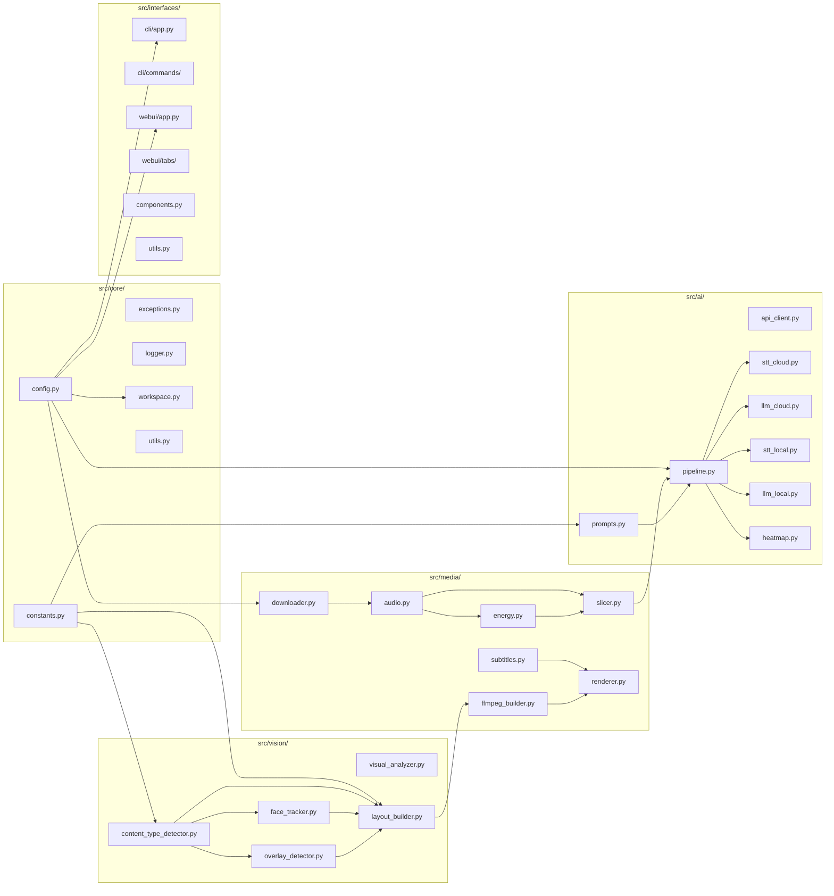

# YaClip — Architecture

Modular Python 3 app: YouTube download → content type detection → engaging moment selection → 9:16 vertical clip render. CLI (typer) + WebUI (gradio). Portable workspace, cloud-first AI with local fallback. **Thresholds and defaults:** see `src/core/constants.py` — never guess numeric values.

---

## Module Map

---

## 1. Portable Asset Cache (`./workspace/`)

All runtime assets in `./workspace/`. OS temp dirs (`/tmp/`, `%TEMP%`) never used.

| Directory | Contents |
|---|---|
| `bin/` | FFmpeg + FFprobe, Bun JS runtime (auto-downloaded) |
| `fonts/` | `.ttf` subtitle fonts (Anton default) |
| `models/` | Local GGUF LLM, Whisper models (`models/hf/` = HuggingFace cache) |
| `videos/` | Raw yt-dlp downloads |
| `audios/` | Extracted audio tracks |
| `subtitles/` | `.ass` subtitle files |
| `data/` | STT transcripts, AI results, word cache, mediashare scan, heatmap, metadata |
| `logs/` | Rotating loguru logs (`app.log`) |
| `tmp/` | Scratch: audio slices, WSL cookie copies |
| `clips/` | Final rendered clips (never purged) |

**Boot:** `ensure_workspace_integrity()` creates dirs, downloads missing binaries/fonts, injects `workspace/bin` into PATH, sets `HF_HOME=./workspace/models/hf/`.

**Purge:** Sequential at startup. Retention: `videos/` 3d, `audios/` 3d, `subtitles/` 3d, `data/` 3d, `tmp/` 1d. Protected: `bin/`, `fonts/`, `models/`.

---

## 2. Content Type Detection (`src/vision/content_type_detector.py`)

Detected once per video (25 frames + YOLO + gameplay probe + HUD score + webcam count). See AGENTS.md Content Detection for decision tree and thresholds.

**Detection pipeline:**

| Step | Signal | Result |
|---|---|---|
| 1. Config override | `content_type_override ≠ "auto"` | Configured value (skip detection) |
| 2. Gameplay gate | `open_area_frac ≥ 0.45` (or ≥ 0.30 w/ `gaming_hint`) + motion/HUD/gaming_hint | Confirmed gameplay |
| 3. Webcam count | `detect_facecams` (filtered persistence/area/edge) | < 2 → SOLO; ≥ 2 → COLLAB |
| 4. No gameplay | ≥ 2 faces → PODCAST; 1 face + donation → JUST_CHAT; 1 face → PODCAST |
| 5. Uncertain | No signals → `None` → LLM with structured evidence block |

**Downstream routing:**

| ContentType | Layout | Face Switch | Donation |
|---|---|---|---|
| `PODCAST` | Mode A — Single Vertical | Active speaker | Excluded by default |
| `JUST_CHAT` | Mode B — Split | No | Disabled by default |
| `GAMING_SOLO` | Mode B — Split | No | Disabled by default |
| `GAMING_SOLO_BOTTOM` | Mode B — Mirrored | No | Disabled by default |
| `GAMING_COLLAB` | Mode C — 3-Stack | No | Excluded by default |
| `DONATION_OVERLAY` | Mode B geometry — Facecam + popup | No | This IS the donation layout |

**Per-clip promotion:** clip with mediashare/donation popup → promoted to `DONATION_OVERLAY` (gated by `preserve_donation_overlays`, default false). Types in `donation_overlay_exclude_types` (default: `["PODCAST", "GAMING_COLLAB"]`) never promoted.

---

## 3. Hybrid AI Pipeline

Independent STT + LLM providers. Each `cloud | local | auto`.

**Provider routing:**

| `stt.provider` | `llm.provider` | Behaviour |
|---|---|---|
| `cloud` (google) | `cloud` (google) | **Single unified Gemini call** — STT + analysis together |
| `cloud` (openai) | `cloud` (any) | Whisper API STT → separate GPT/Gemini LLM |
| `local` | `cloud` | faster-whisper → cloud LLM **(recommended default)** |
| `cloud` | `local` | Cloud STT → local llama-cpp |
| `local` | `local` | Fully offline |

**STT:** Cloud-Google = Gemini audio upload. Cloud-OpenAI = Whisper API. Local = `faster-whisper` (VAD, word timestamps, hallucination filter). **LLM:** Single batched call — all N transcripts → best `target_clips`. Cloud-Google/OpenAI = API call. Local = `llama-cpp-python`. **Memory safety:** sequential load/unload with `del` + `gc.collect()`. Never coexist in RAM.

**Pre-ranking flow:** heatmap/RMS → ranked spikes → pool = target + margin → top-N sliced (`-c copy`) → STT → single batched LLM → post-LLM cap to `target_clips` → dedup (5s overlap) → save.

**Content-aware prompting** (`src/ai/prompts.py`): System prompt injected with `ContentType`, `target_clips`, `target_duration`. Anchors clip boundaries to whole transcript lines. Ranks by HOOK/PAYOFF/STANDALONE/ENERGY rubric.

---

## 4. Clip Selection

**Auto mode:** strategies `ai` (LLM transcript analysis), `heatmap` (YouTube replay spikes), `hybrid` (both combined, recommended). Pre-ranking: `candidate_margin` = additive pool expansion (default 2), so `target_clips + margin` candidates get STT+LLM, rest discarded. Single batched LLM call returns exactly `target_clips`.

**Manual mode:** user provides `START - END` timestamps (bulk, per-line). Optional `| CONTENT_TYPE` suffix pins layout. Selection-config bypass: clips render at user's exact boundaries. LLM titling runs by default (`--no-metadata` to skip).

**Review gate:** proposals displayed in WebUI before render. User approves/edits/deletes. Skippable via `require_review_before_render: false`. See AGENTS.md Clip Selection for CLI flags.

---

## 5. Vision & Layout Tracking

Uses `opencv-python-headless` (safe for WSL/headless).

| Module | Role |
|---|---|
| `visual_analyzer.py` | YOLOv8n region engine: facecam/gameplay/mediashare boxes + text descriptor. Shared by selection, layout, detection |
| `content_type_detector.py` | `detect_content_type` (whole-video); `classify_from_analysis` (manual fallback) |
| `face_tracker.py` | Mode A — speaker tracking: MAR + audio-visual sync, EMA pan, two-shot grouping, occlusion-aware hold |
| `layout_builder.py` | ContentType + regions → FFmpeg layout spec. B/C use static analyzer crops; A uses face-tracker crops |
| `overlay_detector.py` | Appearance/disappearance novelty detection (~2 fps, median baseline, jitter gate) |

**Layout modes:** see AGENTS.md Layout Modes for full specs. Key dimensions: Mode B = 2-stack (2× 1080×960 = 1080×1920), Mode C = 3-stack (3× 1080×640), Mode A = single 1080×1920. Facecam always top in Mode B; gameplay always center in Mode C.

**Subtitle wiring:** renderer reuses pipeline word cache (`{video_id}_words.json`) when available — no redundant Whisper pass. Cache miss → local re-transcription. Three memory-safe passes: (1) YOLO regions, (2) subtitles, (3) FFmpeg encode.

---

## 6. Subtitle Engine (`src/media/subtitles.py`)

| Mode | Config | Behaviour |
|---|---|---|
| Auto | `language: "auto"` | Detect from audio, transcribe, render |
| Manual | `language: "id"` (ISO 639-1) | Transcribe in specified language |
| Disabled | `enabled: false` | Skip all STT and captions |

Word-by-word `.ass` focus effect: active word bold+highlighted, rest normal. Burned via FFmpeg `vf=subtitles`. Hallucination filter: `compression_ratio` / `no_speech_prob` + `avg_logprob` / token repetition → segments dropped. Thresholds defined in `src/core/constants.py` (`STT_COMPRESSION_MAX`, `STT_NO_SPEECH_MAX`, `STT_LOGPROB_MIN`, `STT_REPEAT_TOKEN_MAX`). See AGENTS.md Subtitles for language-locking primer and auto-detect behaviour.

---

## 7. Interfaces

**CLI** (`typer`): `src/interfaces/cli/app.py` orchestrates. Commands in `src/interfaces/cli/commands/` via `register(cli: typer.Typer)` — avoids circular imports.

| Command | Behaviour |
|---|---|
| `clip <URL>` | Full pipeline with config overrides (`--clips`, `--duration`, `--manual`, etc.) |
| `config` | Print validated config (keys masked) |
| `cache status` | Per-dir disk usage |
| `cache purge [--concern]` | Dry-run default; `--concern` confirms |
| `cache clean [target]` | Force-delete all files |
| `serve` | Launch WebUI |

**WebUI** (`gradio`): `src/interfaces/webui/app.py` orchestrates. Tabs built by `src/interfaces/webui/tabs/` (`build_clipper_tab`, `build_review_tab`, `build_settings_tab`, `build_maintenance_tab`).

**Shared utilities** (`src/interfaces/utils.py`): `format_cache_rows`, `mask_config_keys`, `read_clip_sidecar` — used by both CLI and WebUI.

**Routing** (`app.py`): CLI args → Typer; bare → Gradio. Always `.queue().launch()`.

---

## Configuration

Single `config.yaml` at project root. Pydantic validated at startup. Full reference: `config.yaml.example`.

| Section | Owner | Purpose |
|---|---|---|
| `logging` | `src/core/logger.py` | Loguru level, rotation, file path |
| `web_server` | `src/core/config.py` | Gradio host, port, share |
| `ai_pipeline` | `src/ai/pipeline.py` | STT/LLM providers, models, timeouts |
| `downloader` | `src/media/downloader.py` | Resolution, format, cookies |
| `clip_selection` | `src/ai/pipeline.py` | Mode, strategy, clip counts, durations |
| `video_processing` | `src/vision/*`, `src/media/renderer.py` | Override, device, face tracking, overlays, subtitles |
| `workspace_cleanup` | `src/core/workspace.py` | Retention, dry-run, protected dirs |

Hidden override: `dk_clipper_sys_prompt` replaces system prompt when present.

---

## Cross-Platform Concerns

| Concern | Solution |
|---|---|
| WSL cookies | Copy Windows SQLite DB to `workspace/tmp/`, fake profile dir for yt-dlp |
| Path spaces | `pathlib.Path` + subprocess list args |
| FFmpeg binary | `get_ffmpeg_path()` → `workspace/bin/` → system fallback |
| Font resolution | `workspace/fonts/` → OS dirs → WSL `/mnt/c/Windows/Fonts` |
| Headless display | `opencv-python-headless` — no GUI backend |
| Python version | Explicit `python3`, minimum 3.10 |

---

## Key Design Decisions

1. **No `print()`** — all output via `loguru`
2. **Lazy ML imports** — `faster-whisper`, `llama-cpp`, `torch`, `mediapipe` imported inside execution functions
3. **Transcript caching** — STT results as `.txt`, re-runs skip transcription
4. **Content type first-class** — determined before AI brain runs, all downstream is type-aware
5. **No numpy for heatmap** — percentile via pure Python sorted-list indexing
6. **Bun JS bundled** — required by some yt-dlp extractors
7. **Sequential local AI** — STT and LLM never coexist in RAM
8. **FFmpeg `-c copy` pre-slicing** — zero re-encode for speed on low-spec hardware
9. **H.264 encoding with GPU fallback** — `auto` → nvenc if CUDA else libx264; GPU failure → rebuild with libx264, retry once
10. **Degenerate-clip guard** (`MIN_CLIP_SECONDS = 1.0`) — non-positive duration rejected at 4 layers
11. **Auto-generated clip metadata** — `.txt` sidecar with Title/Caption/Description/Hashtags per clip
12. **Configurable cloud timeout** — STT and LLM cloud providers support `timeout` (default 300s, range 30-600)
13. **Zero-padded filenames** — `01_`, `02_`, … with width from total clip count
