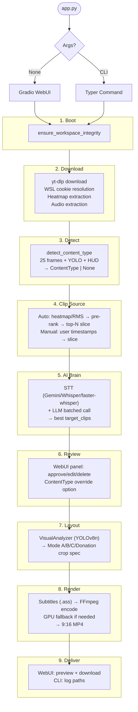

# YaClip — Workflows

Step-by-step data flow: YouTube URL → 9:16 vertical clips.

---

## Pipeline Overview

---

## Stage Details

### 1. Boot (`src/core/workspace.py`)
- Create missing `workspace/` dirs.
- Auto-download FFmpeg, Bun JS, Anton.ttf if missing.
- Inject `workspace/bin` into PATH, set `HF_HOME`.
- Run sequential purge cycle (stale files per retention config).

### 2. Download (`src/media/downloader.py`, `src/media/audio.py`)
- **WSL cookies:** Detect WSL → copy Windows browser SQLite DB to `workspace/tmp/` → fake profile dir for yt-dlp.
- **yt-dlp:** `bestvideo[height<=X]+bestaudio/best[height<=X]`. Save to `workspace/videos/`. Extract heatmap JSON if provided.
- **Audio:** FFmpeg extract to configured codec/quality → `workspace/audios/`.
- Manual mode still downloads — layout detection and subtitles need the source media.

### 3. Content Type Detection (`src/vision/content_type_detector.py`)
See AGENTS.md Content Detection and `ARCHITECTURE.md §2` for decision tree, signals, and routing table.

### 4. Clip Source Routing (`src/ai/pipeline.py`, `src/ai/heatmap.py`, `src/media/energy.py`, `src/media/slicer.py`)

**Auto mode:**

| Source | Module | Mechanism |
|---|---|---|
| YouTube Heatmap | `heatmap.py` | Rank windows by replay value |
| Audio Energy | `energy.py` | FFmpeg 8kHz mono PCM, RMS per 1s chunk |

Pre-rank → pool = `target_clips + margin` → top-N → `-c copy` slice → STT → single batched LLM → cap to `target_clips` → dedup (5s overlap).

**Manual mode:** User timestamps → `start < end` check → slice exact bounds → STT + batched LLM for titling by default (`--no-metadata` to skip).

### 5. AI Brain (`src/ai/`)

**STT step:**

| Provider | Implementation |
|---|---|
| `cloud` (google) | Gemini transcript-only per chunk |
| `cloud` (openai) | Whisper API `verbose_json` |
| `local` | `faster-whisper` — VAD, word timestamps, hallucination filter, `del + gc.collect()` |

**LLM step** (single batched call, all providers):

| Provider | Implementation |
|---|---|
| `cloud` (google) | `generate_content()` — all transcripts → best `target_clips` |
| `cloud` (openai) | Chat completion — all transcripts → best `target_clips` |
| `local` | `llama-cpp-python` — all transcripts → best `target_clips`, `del + gc.collect()` |

**Fast path:** Both `cloud/google` → single unified Gemini call (STT + analysis together).

**Post-processing:** Remap timestamps to original timeline → dedup → save `{id}.json` + `{id}.txt`.

### 6. Review Gate (`src/interfaces/webui/app.py`)
When `require_review_before_render: true`: display proposals with Title, Reasoning, Start, End, ContentType. User edits/approves/deletes, optionally overrides ContentType.

### 7. Vision & Layout (`src/vision/`)
`VisualAnalyzer` samples clip window → `facecam_box`, `gameplay_box`, `screen_inset_box`. Three memory-safe passes: (1) YOLO regions, (2) subtitles, (3) encode.

Layout routing by ContentType → see AGENTS.md Layout Modes for Mode A/B/C/Donation specs.

### 8. Rendering (`src/media/subtitles.py`, `src/media/ffmpeg_builder.py`, `src/media/renderer.py`)
- **Subtitles:** Reuse pipeline word cache when available; fallback to local re-transcription. Word-by-word `.ass` focus effect. Hallucination de-dup before line grouping.
- **Encoding:** Shared flags: `-profile:v high -level 4.1 -pix_fmt yuv420p -r 30 -g 60 -movflags +faststart -c:a aac -b:a 192k -ar 48000 -ac 2`. Codec from `video_processing.video_encoder`. GPU fallback on failure.
- **Output:** `workspace/clips/{VIDEO_ID_UCASE}/{NN}_{Title-Case}.mp4` + `.txt` sidecar.

### 9. Delivery
- **WebUI:** Review & Render tab — HTML5 preview + download buttons.
- **CLI:** Clip paths logged via loguru.

---

## File Naming Conventions

| File | Location | Pattern |
|---|---|---|
| Raw video | `videos/` | `{VIDEO_ID_UCASE}.mp4` |
| Audio track | `audios/` | `{VIDEO_ID_UCASE}.aac` |
| STT transcript | `data/` | `{video_id}.txt` |
| AI clip proposals | `data/` | `{video_id}.json` |
| Word cache (reused for subs) | `data/` | `{video_id}_words.json` |
| Mediashare scan cache | `data/` | `{video_id}_mediashare.json` |
| Video metadata | `data/` | `{video_id}_metadata.json` |
| YouTube heatmap | `data/` | `{video_id}_heatmap_youtube.json` |
| Energy pseudo-heatmap | `data/` | `{video_id}_heatmap_energy.json` |
| Temp audio slices | `tmp/` | `audio_{video_id}_{i}.aac` |
| Subtitle script | `subtitles/` | `subs_{video_id}_{i}.ass` |
| Final clips | `clips/` | `{VIDEO_ID_UCASE}/{NN}_{Title-Case}.mp4` |
| Clip metadata | `clips/` | `{VIDEO_ID_UCASE}/{NN}_{Title-Case}.txt` |
| WSL cookie copy | `tmp/` | `wsl_{browser}_cookies/` |
