# Yet Another AI Auto-Clipper (YaClip) — Workflows

This document details the step-by-step data flow of the YaClip pipeline — how a raw YouTube URL is transformed into final 9:16 vertical clips for YouTube Shorts, Instagram Reels, and TikTok.

---

## The Complete Pipeline

```mermaid
flowchart TD
    Start([Execute app.py]) --> Route{Arguments?}

    Route -- "No args" --> WebUI([Launch Gradio WebUI])
    Route -- "CLI args" --> CLI([Execute Typer Command])

    WebUI --> Boot
    CLI --> Boot

    subgraph S1["1. Boot Sequence"]
        Boot[ensure_workspace_integrity] --> DirCheck[Create ./workspace/ dirs if missing]
        DirCheck --> FFmpegCheck{FFmpeg in workspace/bin/?}
        FFmpegCheck -- No --> FFmpegDL[Download static-ffmpeg binary]
        FFmpegCheck -- Yes --> BunCheck{Bun in workspace/bin/?}
        FFmpegDL --> BunCheck
        BunCheck -- No --> BunDL[Download Bun JS Runtime]
        BunCheck -- Yes --> FontCheck{Font in workspace/fonts/?}
        BunDL --> FontCheck
        FontCheck -- No --> FontDL[Download Anton.ttf from Google Fonts]
        FontCheck -- Yes --> EnvInject[Inject PATH + HF_HOME + Start Purge Scheduler]
        FontDL --> EnvInject
    end

    EnvInject --> URLInput[User Provides YouTube URL]

    subgraph S2["2. Ingestion Engine"]
        URLInput --> ModeSelect{Clip Mode?}
        ModeSelect -- "Auto" --> CookieCheck
        ModeSelect -- "Manual" --> ManualInput[User enters timestamp ranges<br/>MM:SS-MM:SS or HH:MM:SS-HH:MM:SS<br/>one per line, or .txt file upload]
        ManualInput --> CookieCheck
        CookieCheck{Running in WSL?}
        CookieCheck -- Yes --> CopyDB[Copy browser cookies SQLite DB<br/>to ./workspace/tmp/wsl_cookies/]
        CookieCheck -- No --> NativeCookies[Use native browser cookies]
        CopyDB --> Download
        NativeCookies --> Download
        Download["yt-dlp Download<br/>(Bun JS + GitHub extractors)"] --> SaveVid["Save ./workspace/videos/{id}.mp4"]
        Download --> SaveHeatmap["Save heatmap JSON<br/>(if YouTube provides it)"]
        SaveVid --> ExtractAudio["FFmpeg: Extract audio<br/>./workspace/audios/{id}.aac"]
    end

    ExtractAudio --> DetectionStart
    SaveHeatmap --> DetectionStart

    subgraph S3["3. Content Type Detection"]
        DetectionStart[sample_video_frames] --> HUDCheck{Gaming HUD detected?}
        HUDCheck -- Yes, multi-face --> ColabType[ContentType = GAMING_COLLAB]
        HUDCheck -- Yes, single face --> SoloType[ContentType = GAMING_SOLO]
        HUDCheck -- No --> FaceCount{Multiple persistent<br/>face regions +<br/>alternating speech?}
        FaceCount -- Yes --> InterviewType[ContentType = INTERVIEW]
        FaceCount -- No --> OverlayCheck{Donation overlay<br/>signatures detected?}
        OverlayCheck -- Yes --> JustChatType[ContentType = JUST_CHAT]
        OverlayCheck -- No --> PodcastType[ContentType = PODCAST]
        ColabType --> ConfCheck
        SoloType --> ConfCheck
        InterviewType --> ConfCheck
        JustChatType --> ConfCheck
        PodcastType --> ConfCheck
        ConfCheck{Confidence ≥ threshold?}
        ConfCheck -- No --> FallbackPodcast[Fallback to PODCAST<br/>Log warning + frame samples]
        ConfCheck -- Yes --> TypeLocked[ContentType locked<br/>Stored in pipeline state]
        FallbackPodcast --> TypeLocked
    end

    TypeLocked --> ClipModeRoute

    subgraph S4["4. Clip Source Routing"]
        ClipModeRoute{clip_selection.mode?}
        ClipModeRoute -- "manual" --> ManualParse[Parse user timestamp ranges<br/>Validate boundaries]
        ManualParse --> ManualClips[Manual clip list ready]
        ClipModeRoute -- "auto" --> PreSliceStart
        subgraph S4a["Auto: Pre-Slicing & Candidate Pre-Ranking"]
            PreSliceStart[process_audio] --> StratCheck{auto_strategy?}
            StratCheck -- "heatmap" --> HeatmapCheck
            StratCheck -- "ai" --> FullAudioAI[Send full audio to AI<br/>No pre-filtering]
            StratCheck -- "hybrid" --> HeatmapCheck
            HeatmapCheck{Heatmap JSON saved?}
            HeatmapCheck -- Yes --> ParseHeatmap[Parse YT heatmap spikes<br/>Rank by replay value descending]
            HeatmapCheck -- No --> RMSAnalysis[FFmpeg RMS Energy scan<br/>8kHz mono PCM pipe]
            RMSAnalysis --> FindSpikes[Rank spike windows<br/>by RMS score descending]
            ParseHeatmap --> ComputePool
            FindSpikes --> ComputePool
            ComputePool["Compute candidate pool size:<br/>target_clips × candidate_multiplier<br/>e.g. 5 clips × 2 = 10 candidates"]
            ComputePool --> TakeTopN["Take top-N by score<br/>Discard the rest entirely<br/>(no STT, no LLM on discards)"]
            TakeTopN --> HasSpikes{Candidates found?}
            HasSpikes -- No --> FullAudioFallback[Fallback: full audio to AI]
            HasSpikes -- Yes --> SliceAudio["FFmpeg -c copy<br/>~60s chunks for top-N only<br/>(+5s buffer each side)"]
            SliceAudio --> BatchSTT["STT-transcribe all N chunks"]
        end
        BatchSTT --> AIBrain
        FullAudioAI --> AIBrain
        FullAudioFallback --> AIBrain
    end

    ManualClips --> ReviewGate
    AIBrain --> ReviewGate

    subgraph S5["5. AI Brain — Independent STT + LLM"]
        AIBrain["Receive top-N pre-ranked audio chunks<br/>(or full audio if fallback)"] --> BuildPrompt[Build content-aware system prompt<br/>Inject ContentType + target_clips + target_duration]
        BuildPrompt --> UnifiedCheck{"stt = cloud/google<br/>AND llm = cloud/google?"}

        UnifiedCheck -- "Yes → single Gemini call" --> GeminiUnified["Google Gemini — unified call:<br/>Upload all N audio chunks<br/>STT + batched analysis in one request<br/>→ return best target_clips"]
        GeminiUnified --> ParseJSON

        UnifiedCheck -- "No → separate steps" --> STTRoute{stt.provider?}

        STTRoute -- "cloud (google)" --> GeminiSTT["Gemini transcript-only call:<br/>Upload N chunks, transcripts returned"]
        STTRoute -- "cloud (openai)" --> WhisperSTT["OpenAI Whisper API:<br/>N chunks → transcripts"]
        STTRoute -- "local / auto" --> LocalSTT["faster-whisper:<br/>VAD + word timestamps<br/>language from config or auto-detect<br/>del model + gc.collect()"]

        GeminiSTT --> TranscriptsReady["All N transcripts ready"]
        WhisperSTT --> TranscriptsReady
        LocalSTT --> TranscriptsReady

        TranscriptsReady --> LLMRoute{llm.provider?}

        LLMRoute -- "cloud (google)" --> GeminiLLM["Google Gemini — single batched call:<br/>All N transcripts + prompt<br/>→ return best target_clips"]
        LLMRoute -- "cloud (openai)" --> GPTLLM["OpenAI/Compatible — single batched call:<br/>All N transcripts + prompt<br/>→ return best target_clips"]
        LLMRoute -- "local / auto" --> LocalLLM["llama-cpp-python — single call:<br/>All N transcripts + prompt<br/>→ return best target_clips<br/>del model + gc.collect()"]

        GeminiLLM --> ParseJSON
        GPTLLM --> ParseJSON
        LocalLLM --> ParseJSON

        ParseJSON["Parse JSON — exactly target_clips results<br/>strip_json_markdown"] --> RemapTS[Remap chunk timestamps<br/>back to original video timeline]
        RemapTS --> Dedup[Deduplicate clips — 5s overlap tolerance]
        Dedup --> SaveJSON["Save ./workspace/subtitles/{id}.json<br/>Save ./workspace/subtitles/{id}.txt"]
    end

    subgraph S6["6. Review Gate"]
        ReviewGate{require_review_before_render?}
        ReviewGate -- No --> VisionStart
        ReviewGate -- Yes --> ShowReview[Display in WebUI review panel:<br/>Title · Reasoning · Start · End<br/>Detected ContentType + override option]
        ShowReview --> UserAction[User: approve / edit / delete clips<br/>Optionally override ContentType]
        UserAction --> Approve[Approved clip list confirmed]
        Approve --> VisionStart
    end

    subgraph S7["7. Vision & Layout Engine"]
        VisionStart["For each approved clip"] --> SampleFrames["Sample frames from clip time range"]
        SampleFrames --> DonationGate{"mediashare_present?<br/>(preserve_donation_overlays on,<br/>no explicit content_type)"}
        DonationGate -- "Yes" --> ModeDonation["DONATION_OVERLAY (per-clip)<br/>Facecam Top (always fits)<br/>Donation Popup Bottom (forced)"]
        DonationGate -- "No" --> LayoutRoute{ContentType?}

        LayoutRoute -- "PODCAST" --> ModeA_Basic["Mode A — Single Vertical<br/>Face tracker centers on speaker<br/>No switching"]
        LayoutRoute -- "INTERVIEW" --> ModeA_Interview["Mode A — Single Vertical<br/>+ Speaker Switch<br/>Detect active speaker via<br/>diarization / lip-movement<br/>Smooth 0.3–0.5s crop pan on switch"]
        LayoutRoute -- "JUST_CHAT" --> ModeB_Chat["Mode B — Stacked Split-Screen<br/>Facecam Top (always fits)<br/>Streamer/Gameplay Bottom"]
        LayoutRoute -- "GAMING_SOLO" --> ModeB["Mode B — 2-Stack<br/>Facecam Top (always fits)<br/>Motion-Tracked Gameplay Bottom"]
        LayoutRoute -- "GAMING_COLLAB" --> ModeC["Mode C — Multi-Face Collab Stack<br/>Primary Facecam Top<br/>Gameplay Center ← ALWAYS CENTER<br/>Collab Face Grid Bottom"]

        ModeDonation --> LayoutMeta
        ModeA_Interview --> LayoutMeta
        ModeB --> LayoutMeta
        ModeC --> LayoutMeta
        ModeB_Chat --> LayoutMeta
        ModeA_Basic --> LayoutMeta

        LayoutMeta[Output: Layout metadata JSON<br/>crop coords · stack regions · facecam fill mode]
    end

    LayoutMeta --> RenderStart

    subgraph S8["8. Rendering Engine"]
        RenderStart["For each clip"] --> SubtitleCheck{subtitles.enabled?}
        SubtitleCheck -- No --> BuildFilter
        SubtitleCheck -- Yes --> LangCheck{language?}
        LangCheck -- "auto" --> DetectLang[Use auto-detected language<br/>from STT output]
        LangCheck -- "ISO code" --> ManualLang[Use specified language directly]
        DetectLang --> GenASS
        ManualLang --> GenASS
        GenASS["Generate .ass subtitle file<br/>(word-level timestamps +<br/>./workspace/fonts/ font +<br/>config: size · color · outline · margins)"]
        GenASS --> BuildFilter
        BuildFilter["Build FFmpeg filter_complex<br/>(crop + scale + vstack + overlay + subtitles)"]
        BuildFilter --> Encode["FFmpeg encode → 9:16 MP4<br/>(subtitles hard-burned via vf)"]
        Encode --> Export["Export ./workspace/clips/{title}_clips_{i}.mp4"]
        Export --> TmpCleanup["Delete ./workspace/tmp/ scratch files"]
    end

    TmpCleanup --> Delivery

    subgraph S9["9. Delivery"]
        Delivery{Interface?}
        Delivery -- WebUI --> GradioOutput["Gradio Review & Render tab<br/>HTML5 video preview<br/>Download button per clip"]
        Delivery -- CLI --> CLIOutput["Log clip paths to terminal<br/>via loguru"]
    end
```

---

## Detailed Step Descriptions

### 1. Boot Sequence
**Module**: `src/core/workspace.py`

`ensure_workspace_integrity()` runs before any user input is processed:
1. Creates all `./workspace/` subdirectories if missing.
2. Checks `./workspace/bin/` for FFmpeg — downloads via `static-ffmpeg` package if absent.
3. Checks `./workspace/bin/` for Bun JS runtime — downloads OS-specific binary from GitHub releases if absent (required by some yt-dlp extractors).
4. Checks `./workspace/fonts/` — downloads Anton Regular from Google Fonts if absent.
5. Injects `./workspace/bin/` into system `PATH` so subprocess calls resolve FFmpeg/Bun.
6. Sets `HF_HOME=./workspace/models/hf` so HuggingFace downloads stay local.
7. Executes the sequential workspace purge cycle (`run_purge_cycle`) to clean up stale files.

---

### 2. Ingestion Engine
**Modules**: `src/media/downloader.py`, `src/media/audio.py`

- **WSL Cookie Resolution**: If WSL is detected, the Windows host browser's SQLite cookie database is copied to `./workspace/tmp/wsl_{browser}_cookies/` and a fake profile directory structure is created that yt-dlp can consume. This sidesteps cross-OS SQLite file lock failures.
- **Download**: yt-dlp uses `bestvideo[height<=X]+bestaudio/best[height<=X]` format selection. Bun JS and GitHub remote extractors handle bot bypass. Progress hooks support both terminal and Gradio callbacks.
- **Heatmap**: YouTube "Most Replayed" data extracted from `info.get("heatmap")` during download, saved as `{video_id}_heatmap_youtube.json`.
- **Audio**: FFmpeg extracts audio to the configured codec/quality. Supports `aac`, `mp3`, `wav` (with sample rate mapping).
- **Manual mode note**: The URL is still downloaded and audio extracted even in manual mode — layout detection and subtitle generation still run and require the source media.

---

### 3. Content Type Detection
**Module**: `src/vision/content_type_detector.py`

Runs immediately after download, before any AI analysis. Samples frames at regular intervals from the downloaded video and processes three detection signals:

**Step 1 — Gaming HUD Detection:**
Uses template matching or a lightweight frame classifier to detect persistent UI elements: health bars, minimaps, ammo counters, score displays, ability cooldown icons. If a HUD is consistently present across sampled frames — **or** the saved metadata marks the video as the YouTube "Gaming" category (`gaming_hint`, which routes to gaming even when the HUD is small/sub-threshold) — the video is classified as gaming. The **YOLO facecam detector** (`VisualAnalyzer.detect_facecams`) then splits `GAMING_SOLO` vs `GAMING_COLLAB` (≥2 cams ⇒ collab) — it counts persistent, cam-sized person boxes near a frame edge, which catches small corner webcams that MediaPipe misses while rejecting interior game characters.

**Step 2 — Multi-Face Analysis:**
If no HUD is found, MediaPipe FaceDetection counts distinct, spatially-separated, persistent face regions. When two or more are found alongside alternating speech activity (via lip-movement detection or audio energy per face region), the video is classified as `INTERVIEW`.

**Step 3 — Donation Overlay Sampling:**
For single-face, no-HUD content, the detector samples for known donation alert signatures: bright pop-up boxes in screen corners, Trakteer.ID and Saweria visual patterns, MediaShare full-screen video intrusions. If found → `JUST_CHAT`.

**Fallback:**
If all confidence scores are below `detection_confidence_threshold` (default: 0.6), the engine falls back to `PODCAST`, logs a warning with the ambiguous frame samples, and continues. The user can manually override via the WebUI review panel.

The `ContentType` is stored in pipeline state and passed to all downstream modules.

---

### 4. Clip Source Routing
**Modules**: `src/ai/pipeline.py`, `src/ai/heatmap.py`, `src/media/energy.py`, `src/media/slicer.py`

**Auto Mode** (when `clip_selection.mode: "auto"`):

| Data Source | Module | Mechanism |
|---|---|---|
| YouTube Heatmap | `heatmap.py` | Parses `_heatmap_youtube.json`, ranks windows by replay value descending |
| Audio Energy | `energy.py` | Pipes audio through FFmpeg as 8kHz mono PCM, calculates RMS per 1-second chunk, ranks windows by energy score descending |

Both signals produce a **scored, ranked list** of candidate windows. The pipeline then applies the candidate multiplier:

1. Compute pool size: `target_clips × candidate_multiplier` (e.g., user wants 5 clips, multiplier is 2 → pool of 10).
2. Take the **top-N candidates by score**. Discard the rest — no slicing, no STT, no LLM on them.
3. Expand selected windows to min/max clip duration boundaries.
4. Slice the top-N with FFmpeg `-c copy` (zero re-encode) into ~60s audio chunks.
5. STT-transcribe all N chunks (in the local path, this happens before the LLM step; in the cloud Gemini path, audio chunks are uploaded and STT+LLM run together).

**Why pre-ranking matters:** 25 RMS spikes, 5 clips wanted, multiplier 2 → 10 STT calls and 1 LLM call. Without pre-ranking, naïvely: 25 STT calls and 25 LLM calls. The multiplier is the mechanism that connects the user's desired output count to the actual AI compute consumed.

**Manual Mode** (when `clip_selection.mode: "manual"`):
The pre-slicing and ranking steps are skipped entirely. User-provided timestamp ranges are parsed and validated (start < end, within video duration), then passed directly to the Review Gate. No AI analysis occurs.

---

### 5. AI Brain — Independent STT + LLM
**Modules**: `src/ai/pipeline.py`, `src/ai/prompts.py`, `src/ai/api_client.py`, `src/ai/stt_cloud.py`, `src/ai/llm_cloud.py`, `src/ai/stt_local.py`, `src/ai/llm_local.py`

STT and LLM run as two independent steps. Each resolves its own provider from config. All paths converge on a single batched LLM call that receives all N candidate transcripts at once and returns exactly `target_clips` results.

**Prompt construction** (`src/ai/prompts.py`): System prompt injected with `ContentType`, `target_clips`, and `target_duration`. Content-specific criteria embedded per type. Transcript lines carry `[start - end]` times; the prompt anchors clip boundaries to whole lines (no mid-sentence cuts) and ranks candidates by a HOOK/PAYOFF/STANDALONE/ENERGY rubric. `dk_clipper_sys_prompt` in config replaces this entirely if present.

**Fast path — Unified Gemini call** (when both `stt.provider` and `llm.provider` are `"cloud"` with `provider: "google"`):
1. Upload all top-N audio chunks via `genai.upload_file()`. Poll until complete.
2. Single `generate_content()` call — audio + content-aware prompt asking for best `target_clips`.
3. Parse JSON response. Delete all uploaded files from Gemini storage.

**STT step** (all other combinations — runs first, produces transcripts for LLM):

| `stt.provider` | Implementation |
|---|---|
| `cloud` (google) | Gemini called with a transcript-only prompt per chunk. |
| `cloud` (openai) | OpenAI Whisper API — `verbose_json` with segment timestamps per chunk. |
| `local` / `auto` | `faster-whisper` — VAD filter, word timestamps, frozen temperature, hallucination-control decode knobs + a confidence filter that drops laughter/noise segments. `language=None` for auto-detect; ISO code or name (~34 languages) for manual, with a native-language `initial_prompt`. `del model + gc.collect()` after all chunks transcribed. |

**LLM step** (after transcripts are ready — single batched call, all providers):

| `llm.provider` | Implementation |
|---|---|
| `cloud` (google) | Single `generate_content()` call with all N transcripts + prompt → returns best `target_clips`. |
| `cloud` (openai) | Single chat completion call with all N transcripts + prompt → returns best `target_clips`. |
| `local` / `auto` | `llama-cpp-python` from `local.model_path`. Single call, all N transcripts. `del model + gc.collect()` after. |

**Post-processing (all paths):**
- Map chunk-relative timestamps to original video: `original_start = chunk_offset + clip.start_time`.
- Deduplicate with 5s overlap tolerance. Sort chronologically.
- Save to `./workspace/subtitles/{id}.json` and `{id}.txt`.
- Clean temp audio slices from `./workspace/tmp/`.

---

### 6. Review Gate
**Module**: `src/interfaces/webui.py`

When `clip_selection.require_review_before_render: true` (default):
- All clip proposals displayed in the Gradio **Review & Render** tab: Title, Reasoning, Start, End, and the **detected ContentType**.
- User can edit start/end times, modify titles, delete clips.
- User can **override the detected ContentType** for the entire job if detection was wrong — this re-routes the layout engine to the correct mode.
- User confirms the final list before rendering begins.

In Manual Mode, the parsed timestamp ranges appear here for confirmation before rendering.

---

### 7. Vision & Layout Engine
**Modules**: `src/vision/visual_analyzer.py`, `src/vision/face_tracker.py`, `src/vision/layout_builder.py`, `src/vision/overlay_detector.py`

**Region analysis first.** `VisualAnalyzer` (YOLOv8n) samples each clip window and emits precise `facecam_box`, `gameplay_box`, and `screen_inset_box` (MediaShare) regions. The same engine also runs during **clip selection** on each candidate window, attaching a text descriptor to the LLM prompt so audio and visual evidence are aligned over identical time ranges. The renderer executes three memory-safe passes per batch: **(1) regions** (YOLO loaded once, freed), **(2) subtitles** (faster-whisper word-timestamps per clip, freed), **(3) render**.

For each approved clip, using the locked `ContentType` from pipeline state:

**Mode A — PODCAST:**
Face tracker finds the single dominant speaker, generates a 9:16 crop box centered on their face with damped smooth panning. No overlay detection.

**Mode A — INTERVIEW:**
1. Face tracker registers two or more distinct face regions at clip start.
2. Speaker activity is monitored per face region (lip-movement analysis or audio energy correlation).
3. When the active speaker changes, the crop box executes a smooth 0.3–0.5s eased pan transition to the new speaker's face region.
4. The interview subject (person being interviewed) receives crop priority during simultaneous or ambiguous activity.
5. No donation overlay detection.

**Per-clip donation promotion (runs before the routing below):**
The renderer promotes any clip whose window contains a transient mediashare/donation popup (`mediashare_present`) to `DONATION_OVERLAY` (`ClipRenderer._apply_donation_override`, gated by `preserve_donation_overlays`; an explicit per-clip `content_type` is respected). Promoted clips use the DONATION_OVERLAY layout below instead of their base type's layout. This is the only layout that composites donations — Modes A/B/C do not.

**DONATION_OVERLAY (per-clip):**
2-stack reusing the Mode B geometry: **Top** = facecam (always fits). **Bottom** = the donation/mediashare popup, forced — the popup box (appearance/disappearance detector, colour-overlay fallback) expanded to the panel aspect with blurred-background fill; the webcam inset is excluded so the face never duplicates top+bottom. Degrades to the gameplay bottom if forced but no popup box is found.

**Mode B — JUST_CHAT:**
2-stack layout (two 1080×960 panels): facecam always-fits at top; bottom = a lower-region streamer / gameplay crop. Donations handled by the promotion above.

**Mode B — GAMING_SOLO:**
2-stack layout (two 1080×960 panels = 1080×1920). **Top = Facecam (always fits)** — the stable cam box is expanded ~1.45× and shaped to the panel aspect, then crop-filled into the panel **sharp, prominent (cam ≈69% of panel height), with no blur and no left/right bars** (mild upscale when the cam is small). **Bottom** = the **centered panel-aspect gameplay crop** zoomed by `gameplay_zoom` (default 1.25× — drops the bottom ticker from the panel). When `gameplay_follow_motion: true`: camera is **static-first** — holds position until the motion weighted-centroid drifts beyond a deadzone (≈6% panel width), then glides toward the target at ≤1.2% panel width per keyframe (imperceptible to viewers). No black/subtitle-pad third zone.

**Mode C — GAMING_COLLAB:**
Three-region stack (each 1080×640): Primary Facecam Top, Gameplay Center (ALWAYS center), Collaborator Bottom. Both cams come from the reliable **`detect_facecams` pair** (locked once video-wide — the same detector that drives the SOLO-vs-COLLAB split), passed to `analyze_window(facecam_boxes=…)` as `facecam_box` (top) + `collab_box` (bottom); the per-clip `persons` heuristic is only a fallback when the pair is absent. **Both cam boxes are excluded from the gameplay centre** — masked out of the motion search, and when they sit in the bottom third the crop is shrunk + biased upward so its bottom edge clears the highest bottom cam — so neither corner cam bleeds into the gameplay (no "double facecam"). A `GAMING_COLLAB` clip **stays a 3-stack even with a donation** (the donation promotion is skipped for collab).

**Output**: Structured layout metadata JSON passed to `ffmpeg_builder.py`.

---

### 8. Rendering Engine
**Modules**: `src/media/subtitles.py`, `src/media/ffmpeg_builder.py`, `src/media/renderer.py`

**Subtitle generation** (`subtitles.py` + `stt_local.transcribe_segments`):
- If `video_processing.subtitles.enabled: false` → skip all subtitle steps.
- If enabled: the subtitle pass first **reuses the pipeline's per-candidate word cache** (`{video_id}_words.json`) — when a clip falls inside a cached candidate window its words are sliced from the cache and **no Whisper runs**. Clips with no cache hit (cloud STT, manual mode, boundary miss) are **re-transcribed locally** with faster-whisper `word_timestamps=True` (one shared model load). Either way word-level captions are guaranteed independent of the selection provider.
- **Word-by-word focus effect:** consecutive Dialogue events show the full line with the active word **bold + 12% scaled up + configurable highlight colour** (`\b1\fscx112\fscy112\c&H…&`) while the rest renders normally. One event per word. Default font size 80, outline thickness 6, highlight colour soft blue (`&H00FFC896`). Font loaded from `./workspace/fonts/Anton.ttf`.
- **Hallucination de-duplication:** before line grouping, `_collapse_repeats()` merges consecutive identical words (case/punctuation-insensitive) into the first occurrence, extending its end timestamp — eliminates Whisper laughter-token repetitions ("HEHEHE HEHEHE HEHEHE" → "HEHEHE").
- Language used is what was configured or auto-detected; it is passed to `model.transcribe(language=...)`.

**Encoding** (all layout modes):
`libx264 -profile:v high -level 4.1 -preset veryfast -crf 20 -pix_fmt yuv420p -r 30 -g 60 -movflags +faststart -c:a aac -b:a 192k -ar 48000 -ac 2`. Every layout mode's filtergraph includes `setsar=1` to enforce 1:1 square-pixel SAR — required for 9:16 display on YouTube Shorts, Instagram Reels, and TikTok.

**Filter graph construction** (`ffmpeg_builder.py`):
- Consumes layout metadata from the vision engine.
- Composes the FFmpeg `filter_complex` string for the detected layout mode: crop → scale → vstack (for B/C) → overlay (for PiP) → subtitles.
- Every non-trivial filter chain has a comment block explaining each step in plain English (per AGENTS.md §11.14).

**Encoding** (`renderer.py`):
- Single FFmpeg subprocess call (list form, explicit timeout, stderr captured).
- Subtitles hard-burned via `vf="subtitles=..."` — no soft-sub reliance.
- Output: `./workspace/clips/{title}_clips_{i}.mp4` at configured resolution.
- Temp files in `./workspace/tmp/` deleted after successful render.

---

### 9. Delivery

**WebUI**: Final clips appear in the **Review & Render** tab output section with HTML5 video preview and per-clip download buttons.

**CLI**: Final clip paths logged to terminal via loguru at INFO level.

---

## File Naming Conventions

| File | Location | Pattern |
|---|---|---|
| Raw video | `./workspace/videos/` | `{video_id}.mp4` |
| Audio track | `./workspace/audios/` | `{video_id}.aac` |
| STT transcript | `./workspace/subtitles/` | `{video_id}.txt` |
| AI clip proposals | `./workspace/subtitles/` | `{video_id}.json` |
| STT word cache (reused for subtitles) | `./workspace/subtitles/` | `{video_id}_words.json` (per-candidate word-level segments, absolute times) |
| Video metadata | `./workspace/subtitles/` | `{video_id}_metadata.json` (title/category/tags → LLM game context) |
| YouTube heatmap | `./workspace/subtitles/` | `{video_id}_heatmap_youtube.json` |
| Energy pseudo-heatmap | `./workspace/subtitles/` | `{video_id}_heatmap_energy.json` |
| Temp audio slices | `./workspace/tmp/` | `{video_id}_slice_{i}.aac` |
| WSL cookie copy | `./workspace/tmp/` | `wsl_{browser}_cookies/` |
| Subtitle script | `./workspace/tmp/` | `{video_id}_clip_{i}.ass` |
| Final clips | `./workspace/clips/` | `{title}_clips_{i}.mp4` |